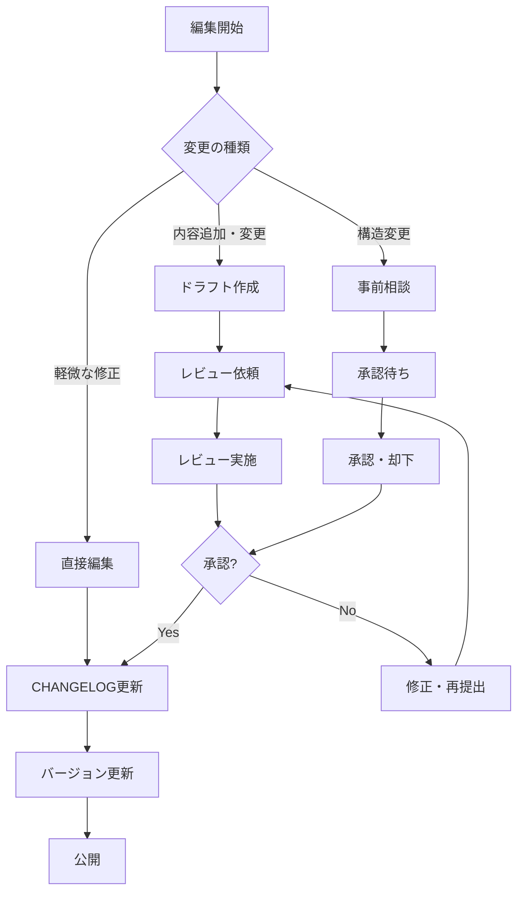

# 編集・貢献ガイドライン

**Microsoft 365 ハンドブック** への貢献をお考えいただき、ありがとうございます。このドキュメントは、一貫した品質と実用性を保つための編集・貢献ガイドラインです。

---

## 🎯 プロジェクトの目的

このハンドブックは、Microsoft 365の構築・運用管理を初めて行う以下の方々を対象としています：

- **システムインテグレーター（SIer）の技術者**
- **教育機関のIT管理者・教育委員会の担当者**
- **企業のIT管理者（初級〜中級レベル）**

**目標**: 実際の業務でそのまま活用できる実践的なガイドの提供

---

## 📝 編集ルール・技術要件

### **基本的な技術仕様**

| 項目 | 要件 |
|------|------|
| 文字コード | UTF-8 |
| 改行コード | LF (Unix形式) |
| インデント | スペース2文字 |
| ファイル形式 | Markdown (.md) |
| 言語 | 日本語（主要言語）|

### **Markdownスタイルガイド**

```markdown
# 章レベル（H1）- 各章のメインタイトル
## セクションレベル（H2）- 章内の主要トピック
### サブセクションレベル（H3）- 詳細トピック
#### 項目レベル（H4）- 手順や詳細説明

<!-- 強調テキスト -->
**重要なポイント**: 太字で強調
*補足情報*: イタリックで表示

<!-- コードブロック -->
```powershell
# PowerShellコマンド例
Get-MsolUser -UserPrincipalName "user@domain.com"
```

<!-- 情報ボックス -->
> 💡 **ヒント**: 実用的なアドバイス
> 
> ⚠️ **注意**: 重要な警告事項
> 
> 📋 **チェックリスト**: 確認すべき項目
```

### **ファイル・フォルダ命名規則**

```
章フォルダ: [2桁番号]-[英語名]/
例: 01-overview/, 02-initial-setup/, 03-user-management/

ファイル: [2桁番号]-[英語名].md
例: 01-what-is-m365.md, 02-subscription-plans.md

画像ファイル: [セクション名]-[内容]-[番号].png
例: admin-center-dashboard-01.png, teams-settings-02.png
```

---

## 🔄 更新プロセス・ワークフロー

### **1. 貢献の種類**

| 貢献タイプ | 説明 | 承認プロセス |
|------------|------|-------------|
| **軽微な修正** | 誤字脱字、リンク修正 | 直接編集可能 |
| **内容追加** | 新しい手順、補足情報 | レビュー必須 |
| **構造変更** | 章構成、大幅な変更 | 事前相談・承認必須 |
| **新章追加** | 全く新しい章の追加 | プロジェクト会議で決定 |

### **2. 更新手順**



### **3. 必須更新項目**

編集後は以下を必ず更新してください：

1. **CHANGELOG.md** - 変更内容を記録
2. **該当章のREADME.md** - 最終更新日を更新
3. **関連リンク** - 相互参照の確認・更新

```markdown
<!-- CHANGELOGエントリ例 -->
## [1.1.0] - 2025-06-15
### 追加
- 第3章：多要素認証（MFA）設定の詳細手順追加
- PowerShellスクリプト例：一括ユーザー権限変更

### 変更
- 第2章：管理センターUIの2025年6月版に更新

### 修正
- 第5章：リンク切れ修正（3件）
```

---

## 📚 コンテンツ作成ガイドライン

### **文章スタイル**

- **読みやすさ最優先**: 専門用語には必ず説明を併記
- **実践的な内容**: 「なぜその設定が必要か」も説明
- **ステップバイステップ**: 手順は番号付きリストで明確に
- **視覚的な配慮**: 長文は適切に改行・段落分け

```markdown
<!-- ✅ 良い例 -->
## 2.1 カスタムドメインの追加

Microsoft 365では、初期状態で `your-org.onmicrosoft.com` というドメインが提供されますが、実際の運用では独自ドメイン（例：`school.edu.jp`）を使用することが一般的です。

### 前提条件
- ドメインのDNS管理権限
- グローバル管理者権限

### 手順
1. Microsoft 365管理センター（https://admin.microsoft.com）にアクセス
2. **設定** > **ドメイン** をクリック
3. **ドメインを追加** を選択
...

<!-- ❌ 避けるべき例 -->
カスタムドメインを追加します。管理センターでドメイン設定を行い、DNSレコードを設定してください。
```

### **必須含有要素**

各セクションには以下を含めてください。

- **目的・背景**: なぜこの作業が必要か
- **前提条件**: 必要な権限や事前設定
- **詳細手順**: 画面操作の具体的な説明
- **確認方法**: 設定が正しく完了したかの確認手順
- **トラブルシューティング**: よくある問題と解決方法

### **コードブロック・コマンド例**

```powershell
# PowerShellコマンドの例示方法
# 1. 目的を明記
# 2. 前提条件を説明
# 3. 実行コマンド
# 4. 期待される出力例

# Microsoft Graph PowerShellモジュールでユーザー一覧取得
Connect-MgGraph -Scopes "User.Read.All"
Get-MgUser -All | Select-Object DisplayName, UserPrincipalName, AccountEnabled
```

---

## 📸 スクリーンショット・メディアガイドライン

### **撮影要件**

| 項目 | 要件 |
|------|------|
| **解像度** | 最低1920x1080（フルHD） |
| **フォーマット** | PNG推奨（JPEG可） |
| **言語設定** | 日本語UI |
| **ブラウザ** | Microsoft Edge推奨 |
| **個人情報** | 完全にマスキング |

### **撮影・編集ルール**

```markdown
<!-- スクリーンショットの命名・配置例 -->


<!-- 図表の説明例 -->

*図2-1: Microsoft 365テナントの基本構成と主要コンポーネント*
```

### **個人情報保護**

- **氏名**: "田中太郎", "Microsoft User"などの仮名使用
- **メールアドレス**: example.com, contoso.com等のサンプルドメイン使用
- **組織名**: "Sample School", "Example Corp"等の仮名使用
- **電話番号・住所**: 完全にマスキングまたはサンプルデータ使用

### **画像最適化**

```bash
# 画像サイズ最適化（推奨ツール）
# PNGの場合
pngquant --quality=80-95 input.png --output output.png

# 画像サイズ目安
# スクリーンショット：500KB以下
# 図表・ダイアグラム：200KB以下
```

---

## 🔍 品質管理・レビュープロセス

### **セルフチェックリスト**

編集完了後、以下を必ず確認してください。

#### **コンテンツ品質**
- [ ] 誤字脱字チェック完了
- [ ] 専門用語の説明追加
- [ ] 手順の論理的順序確認
- [ ] 実際の操作での動作確認

#### **技術的要件**
- [ ] リンク切れチェック
- [ ] 画像表示確認
- [ ] Markdownシンタックス確認
- [ ] 相対パスの正確性確認

#### **ユーザビリティ**
- [ ] 初心者でも理解可能な説明
- [ ] 手順の漏れ・曖昧さなし
- [ ] トラブルシューティング情報提供

### **レビュープロセス**

```markdown
<!-- レビュー依頼時のテンプレート -->
## レビュー依頼

**変更対象**: 第3章 ユーザー管理 - セクション3.2
**変更理由**: 2025年6月の管理センターUI更新に対応
**変更概要**: 
- スクリーンショット5枚を最新版に更新
- 手順2-4でメニュー名変更に対応
- 新機能「一括権限変更」の説明追加

**確認依頼事項**:
- [ ] 手順の正確性
- [ ] スクリーンショットの見やすさ
- [ ] 初心者向けの説明として適切か

**テスト環境**: Microsoft 365 E3ライセンス、日本語環境
```

---

## 💬 コミュニケーション・サポート

### **質問・相談チャネル**

| 内容 | 連絡方法 | 対応時間 |
|------|----------|----------|
| **技術的質問** | Issues作成 | 平日2営業日以内 |
| **編集相談** | プロジェクトチャット | 平日リアルタイム |
| **緊急修正** | 直接連絡 | 24時間以内 |

### **定期的なコミュニケーション**

- **週次会議**: 毎週火曜 10:00-10:30（進捗確認）
- **月次レビュー**: 毎月第1金曜 14:00-15:00（品質・方向性確認）
- **四半期計画**: 各四半期初月第1週（新機能対応・大幅更新計画）

---

## 🛠️ 開発・運用ツール

### **推奨編集環境**

```markdown
<!-- エディタ設定例（VS Code） -->
{
  "editor.wordWrap": "on",
  "editor.rulers": [80],
  "markdown.extension.toc.levels": "2..4",
  "markdown.extension.list.indentationSize": "adaptive"
}
```

### **自動化ツール**

```bash
# リンクチェック（月次実行）
markdown-link-check docs/**/*.md

# 画像最適化（新規追加時）
./tools/optimize-images.sh

# 文法チェック（公開前）
textlint docs/**/*.md
```

### **バックアップ・バージョン管理**

- **Git**: すべての変更履歴を管理
- **週次バックアップ**: 自動的に実行
- **タグ管理**: リリース時に必ずタグ付け

---

## 📊 成果測定・改善プロセス

### **品質指標（KPI）**

| 指標 | 目標値 | 測定頻度 |
|------|---------|----------|
| リンク切れ率 | < 1% | 週次 |
| 画像表示エラー率 | < 0.5% | 週次 |
| ユーザーフィードバックスコア | > 4.0/5.0 | 月次 |
| 手順実行成功率 | > 95% | 四半期 |

### **継続的改善**

- **ユーザーフィードバック分析**: 月次で改善点を抽出
- **Microsoft 365新機能**: 四半期ごとに大幅アップデート
- **競合分析**: 年次で他の技術文書との比較分析

---

## 🎉 貢献者への感謝

このプロジェクトは多くの方々の貢献により成り立っています。貢献者の皆様には以下の形で感謝を表現します。

- **README.mdでの氏名・組織名記載**（希望者のみ）
- **年次感謝状の送付**
- **Microsoft 365関連イベントでの優先案内**

---

**最後に**: このハンドブックは「実際の現場で使える実用的なガイド」を目指しています。読者の立場に立った親切で実践的なコンテンツ作成にご協力をお願いいたします。

**連絡先**: [プロジェクトIssues](issues) | [編集チーム](nahisaho@microsoft.com)

---

*最終更新: 2025年6月1日*