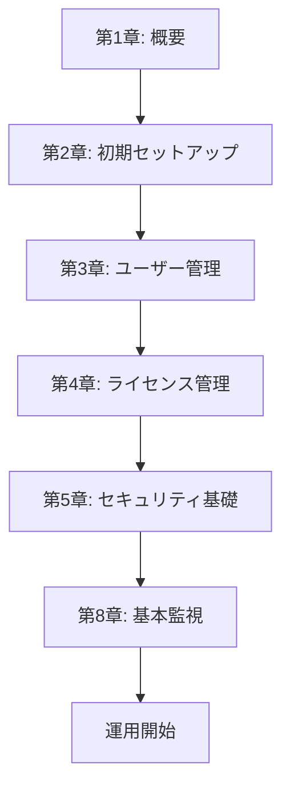
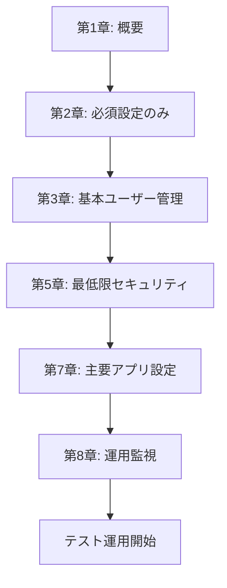
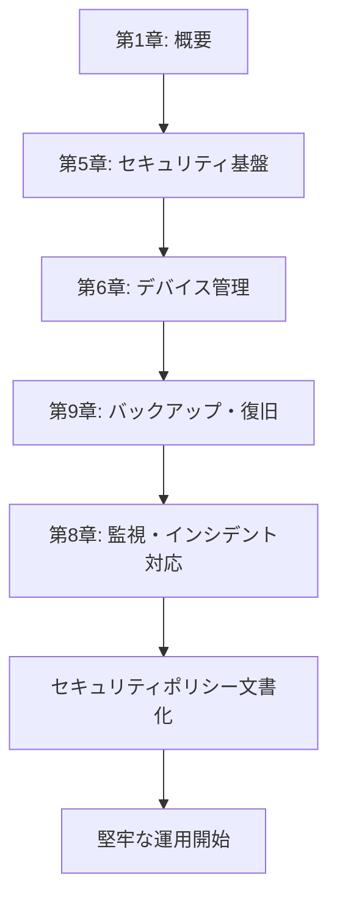
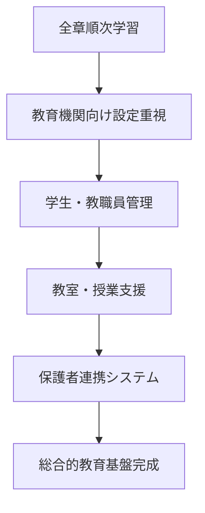

# はじめてのMicrosoft 365 - IT管理者のための実践ハンドブック

<div align="center">

[](http://creativecommons.org/licenses/by/4.0/)


**📚 Microsoft 365の構築・運用管理を初めて行う方向けの包括的実践ガイド**

[📖 学習を始める](#-クイックスタート) | [🎯 学習パス選択](#-学習パス選択) | [🔧 実用リソース](#-実用リソース) | [📞 サポート](#-サポート・貢献)

</div>

---

## 🎯 概要

このハンドブックは、**Microsoft 365の構築と運用管理を初めて行う方**を対象とした実践的なガイドブックです。2025年6月時点の最新機能に対応し、実際の業務ですぐに活用できる具体的な手順と設定例を提供します。

### ✨ 特徴

- **🆕 最新対応**: 2025年6月時点のMicrosoft 365最新機能・UI対応
- **🎓 教育機関特化**: 学校・大学での導入、運用を前提としたシナリオ
- **💼 SIer対応**: システムインテグレーター向けの技術的な詳細解説
- **⚡ 実践重視**: PowerShellスクリプト・設定テンプレート・チェックリスト完備
- **🔒 セキュリティ重視**: ゼロトラスト・コンプライアンス要件に対応

---

## 👥 対象読者

| 読者層 | 想定レベル | 主な関心事 |
|--------|-----------|-----------|
| **SIer技術者** | 中級～上級 | 顧客環境での効率的な構築・移行 |
| **教育機関IT管理者** | 初級～中級 | 学校特有の要件・セキュリティ対応 |
| **企業IT担当者** | 初級～中級 | 既存システムからの移行・運用 |
| **Microsoft 365初学者** | 初級 | 基礎から実践まで体系的学習 |

### 前提知識
- ✅ 基本的なWindows操作
- ✅ クラウドサービスの基本概念
- ✅ ネットワークの基礎知識
- ⭐ PowerShell経験（推奨・必須ではない）

---

## 🚀 クイックスタート

### 1️⃣ 学習パスを選択
まず[📋 table-of-contents.md](table-of-contents.md)で、あなたの状況に最適な学習パスを選択してください。

```
🔰 初心者向け（2週間）    → 基礎から段階的に学習
⚡ 緊急導入（1週間）      → 最小限の設定で運用開始
🔒 セキュリティ重視（10日） → 堅牢な基盤から構築
🎓 教育機関向け（3週間）   → 全章を体系的に学習
```

### 2️⃣ 環境準備
学習・実践に必要な環境を準備します。

- **Microsoft 365テナント**: [無料試用版](https://www.microsoft.com/microsoft-365/education)を取得
- **管理者権限**: 全体管理者または相当の権限
- **DNS管理権限**: カスタムドメイン利用の場合
- **推奨ブラウザ**: Microsoft Edge（最新版）

### 3️⃣ 学習開始
選択した学習パスに従って、各章を順次学習します。

| ステップ | 内容 | 所要時間 |
|---------|------|----------|
| **基礎理解** | [第1章: 概要](docs/01-overview/) | 1-2時間 |
| **環境構築** | [第2章: 初期セットアップ](docs/02-initial-setup/) | 3-4時間 |
| **ユーザー管理** | [第3章: ユーザー管理](docs/03-user-management/) | 4-5時間 |
| **ライセンス** | [第4章: ライセンス管理](docs/04-license-management/) | 2-3時間 |
| **セキュリティ** | [第5章: セキュリティ](docs/05-security-compliance/) | 7-9時間 |

### 4️⃣ 実践・検証
[📋 チェックリスト](appendices/checklists/)を使用して設定完了を確認し、本格運用を開始します。

---

## 📚 章構成

<details>
<summary><strong>📖 全10章の詳細構成（クリックで展開）</strong></summary>

### **概要・準備編**
| 章 | タイトル | 学習時間 | 難易度 | 重要度 |
|----|----------|----------|--------|--------|
| **第1章** | [Microsoft 365 概要](docs/01-overview/) | 1-2時間 | ⭐⭐ | 🔴 最高 |
| **第2章** | [初期セットアップ](docs/02-initial-setup/) | 3-4時間 | ⭐⭐⭐ | 🔴 最高 |

### **基盤構築編**
| 章 | タイトル | 学習時間 | 難易度 | 重要度 |
|----|----------|----------|--------|--------|
| **第3章** | [ユーザー管理](docs/03-user-management/) | 4-5時間 | ⭐⭐⭐ | 🔴 最高 |
| **第4章** | [ライセンス管理](docs/04-license-management/) | 2-3時間 | ⭐⭐ | 🟡 高 |

### **セキュリティ・管理編**
| 章 | タイトル | 学習時間 | 難易度 | 重要度 |
|----|----------|----------|--------|--------|
| **第5章** | [セキュリティとコンプライアンス](docs/05-security-compliance/) | 7-9時間 | ⭐⭐⭐⭐⭐ | 🔴 最高 |
| **第6章** | [デバイス管理](docs/06-device-management/) | 4-6時間 | ⭐⭐⭐⭐ | 🟡 高 |
| **第7章** | [アプリケーション設定](docs/07-app-configuration/) | 5-7時間 | ⭐⭐⭐ | 🟡 高 |

### **運用・保守編**
| 章 | タイトル | 学習時間 | 難易度 | 重要度 |
|----|----------|----------|--------|--------|
| **第8章** | [運用監視・トラブルシューティング](docs/08-monitoring-troubleshooting/) | 4-5時間 | ⭐⭐⭐ | 🔴 最高 |
| **第9章** | [バックアップと復旧](docs/09-backup-recovery/) | 3-4時間 | ⭐⭐⭐⭐ | 🟠 中 |
| **第10章** | [最新機能と今後の展開](docs/10-latest-features/) | 2-3時間 | ⭐⭐ | 🟠 中 |

</details>

---

## 🎯 学習パス選択

あなたの状況に最適な学習順序を選択してください。

<details>
<summary><strong>🔰 初心者向け学習パス（約2週間）</strong></summary>

**対象**: Microsoft 365を初めて学ぶ方・基礎から確実に習得したい方



**学習計画例:**
- **Week 1**: 第1-2章（概要・セットアップ）
- **Week 2**: 第3-4章（ユーザー・ライセンス）+ 第5章（基本セキュリティ）

</details>

<details>
<summary><strong>⚡ 緊急導入パス（約1週間）</strong></summary>

**対象**: 短期間で運用開始が必要な方・最小限の機能で開始したい方



**重要**: 運用開始後、第5章・第9章の残り部分を順次実装

</details>

<details>
<summary><strong>🔒 セキュリティ重視パス（約10日）</strong></summary>

**対象**: セキュリティ要件が厳しい組織・コンプライアンス重視の方



**特徴**: ゼロトラスト・多層防御の実装重視

</details>

<details>
<summary><strong>🎓 教育機関向けパス（約3週間）</strong></summary>

**対象**: 学校・大学のIT管理者・教育特有の要件がある方



**重点項目**:
- Teams for Education
- School Data Sync
- 保護者アカウント管理
- 学習データ保護

</details>

---

## 🔧 実用リソース

### 📋 チェックリスト
運用段階別の確認項目で、設定漏れを防止：

- **[導入完了チェックリスト](appendices/checklists/deployment-checklist.md)**: 初期セットアップ完了確認
- **[セキュリティ設定チェックリスト](appendices/checklists/security-checklist.md)**: セキュリティ基盤確認
- **[運用開始チェックリスト](appendices/checklists/operation-checklist.md)**: 本格運用前の最終確認

### ⚙️ PowerShellコマンド集
日常業務でよく使用するコマンドを体系化：

```powershell
# 接続認証
Connect-MsolService
Connect-ExchangeOnline

# ユーザー管理
Get-MsolUser | Export-Csv "users.csv"
Set-MsolUserLicense -UserPrincipalName "user@domain.com" -AddLicenses "tenant:STANDARDWOFFPACK"

# ライセンス管理
Get-MsolAccountSku
Get-MsolUser -UnlicensedUsersOnly
```

📖 [完全版はこちら](appendices/powershell-commands.md)

### 📄 テンプレート集
すぐに使用できる設定テンプレート：

| テンプレート | 用途 | ファイル |
|-------------|------|---------|
| **CSV一括登録** | ユーザー大量追加 | [user-import-template.csv](appendices/templates/user-import-template.csv) |
| **DNS設定** | カスタムドメイン追加 | [dns-records-template.md](appendices/templates/dns-records-template.md) |
| **セキュリティポリシー** | 組織標準設定 | [security-policy-template.json](appendices/templates/security-policy-template.json) |
| **インシデント対応** | 緊急時報告書 | [incident-report-template.md](appendices/templates/incident-report-template.md) |

### 🔗 重要なURL集
Microsoft 365関連の管理ポータル・サポートサイト：

| カテゴリ | サービス | URL |
|----------|----------|-----|
| **主要管理センター** | Microsoft 365 admin center | https://admin.microsoft.com |
| | Microsoft Entra admin center | https://entra.microsoft.com |
| | Microsoft Defender XDR | https://security.microsoft.com |
| **サポート** | Microsoft Learn | https://learn.microsoft.com |
| | Microsoft Tech Community | https://techcommunity.microsoft.com |
| **ライセンス** | 教育機関向けライセンス | https://www.microsoft.com/education |

📖 [完全版URL集はこちら](appendices/important-urls.md)

---

## 📈 更新・バージョン情報

### 🔄 最新情報の追跡

Microsoft 365は頻繁にアップデートされるため、以下の方法で最新情報をキャッチアップしてください：

- **📢 Message Center**: 管理センター内での公式アナウンス確認
- **🛣️ Microsoft 365 Roadmap**: 今後の機能リリース予定
- **📚 Microsoft Learn**: 新機能の学習コンテンツ
- **👥 Tech Community**: 管理者コミュニティでの情報交換

### 📊 Version 1.0 (2025年6月)

**主要な対応機能:**
- ✅ Microsoft 365 Copilot Wave 2
- ✅ SharePoint Agents・Flexible sections
- ✅ 2025年廃止予定機能の移行ガイド
- ✅ ゼロトラストセキュリティモデル
- ✅ 教育機関向け最新機能

**今後の予定:**
- **2025年9月**: Microsoft Ignite 2025対応版リリース
- **2025年12月**: 年次大型アップデート対応
- **2026年3月**: Version 2.0（新機能大幅追加）

📖 [詳細な更新履歴](CHANGELOG.md)

---

## 💡 よくある質問（FAQ）

<details>
<summary><strong>Q: 学習にはどのくらいの時間が必要ですか？</strong></summary>

**A**: 学習パスによって異なります：

- **初心者向け**: 約2週間（1日2-3時間）
- **緊急導入**: 約1週間（1日4-5時間）
- **セキュリティ重視**: 約10日（1日3-4時間）
- **教育機関向け**: 約3週間（1日2-3時間）

実際の作業時間は学習時間の2-3倍を見込むことを推奨します。

</details>

<details>
<summary><strong>Q: PowerShellの知識は必須ですか？</strong></summary>

**A**: 必須ではありませんが、推奨です：

- **基本操作**: GUI（管理センター）での操作で大部分は完了
- **効率化**: PowerShellを使用すると一括処理・自動化が可能
- **学習**: 本ハンドブックにコマンド例を豊富に記載
- **段階的習得**: 基本操作習得後にPowerShellに挑戦でもOK

</details>

<details>
<summary><strong>Q: 教育機関でない場合でも活用できますか？</strong></summary>

**A**: はい、十分活用できます：

- **基本機能**: Microsoft 365の基本機能は共通
- **設定方法**: セキュリティ・ユーザー管理は業種共通
- **読み替え**: 「学校」→「会社」、「学生」→「従業員」として読み替え
- **ライセンス**: Business版の場合はライセンス体系のみ異なる

企業向けの具体例も適宜記載しています。

</details>

<details>
<summary><strong>Q: 古いバージョンのOfficeから移行する場合の注意点は？</strong></summary>

**A**: 段階的な移行を推奨します：

1. **事前準備**: [第9章](docs/09-backup-recovery/)でデータバックアップ
2. **パイロット**: 一部ユーザーでの先行導入
3. **段階移行**: 部署・グループ単位での順次移行
4. **完全移行**: 全社での切り替え

特に2025年10月にOffice 2016/2019のサポート終了があるため、早めの計画を推奨します。

</details>

---

## 📞 サポート・貢献

### 🤝 コミュニティサポート

質問・情報交換・相互サポートのためのチャンネル：

- **💬 Discussions**: GitHub Discussionsで質問・議論
- **🐛 Issues**: バグ報告・機能要望
- **📧 Email**: nahisaho@microsoft.com（緊急時のみ）
- **🌐 Web**: https://github.com/nahisaho/m365-admin-handbook

### 📝 貢献・編集への参加

このハンドブックの改善にご協力ください：

1. **📖 誤字・脱字の修正**: 軽微な修正のPull Request歓迎
2. **📸 スクリーンショット更新**: 最新UIに対応した画像提供
3. **💡 実用事例の追加**: 実際の運用での成功事例・失敗事例
4. **🔧 スクリプト・テンプレート**: 実用的なツールの提供

📖 [貢献ガイドライン](CONTRIBUTING.md)

### 🆘 Microsoft公式サポート

技術的な問題や製品固有の質問：

- **💻 オンラインサポート**: https://www.microsoft.com/ja-jp/microsoft-365/support 
- **🚀 FastTrack**: https://www.microsoft.com/ja-jp/fasttrack
- **📚 Microsoft Learn**: https://learn.microsoft.com

---

## 📄 ライセンス

このプロジェクトは[**Creative Commons Attribution 4.0 International License (CC BY 4.0)**](LICENSE.md)の下で公開されています。


### ⚖️ 利用について

**CC BY 4.0では以下の利用が認められています。**

- **✅ 共有（Share）**: あらゆる媒体・形式での複製・配布
- **✅ 翻案（Adapt）**: リミックス・改変・二次的著作物の作成
- **✅ 商用利用**: 商業目的での利用
- **✅ 印刷・配布**: 研修資料としての印刷・配布

**利用条件：**
- **📝 表示（Attribution）**: 適切なクレジット表示・ライセンスへのリンク・変更の明示

**免責事項：**
- **❌ 保証なし**: 内容の正確性・完全性・適合性は保証されません
- **❌ 責任なし**: 利用による損害について著作者は責任を負いません

---

## 🙏 謝辞

このハンドブックの作成にあたり、以下の方々・組織に感謝いたします。

- **Microsoft Corporation**: 製品・ドキュメントの提供
- **Microsoft MVP Community**: 技術的知見・レビューの提供
- **教育機関のIT管理者**: 実用的フィードバック・事例提供
- **SIer技術者**: 導入・運用のベストプラクティス提供

---

⭐ **このプロジェクトが役に立ったら、Star をお願いします！** ⭐


</div>