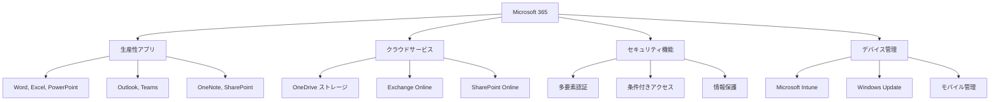

# 1.1 Microsoft 365とは

**Microsoft 365**は、マイクロソフトが提供するクラウドベースの統合生産性プラットフォームです。従来のOfficeアプリケーション、クラウドサービス、セキュリティ機能、デバイス管理機能を1つのサブスクリプションで利用できる包括的なソリューションです。

## 📖 この節で学習すること

- Microsoft 365の基本概念と構成要素
- 従来のOfficeとの違い
- 2025年時点での最新機能とサービス
- 教育機関・企業での導入メリット
- ライセンス体系の概要

---

## 🎯 Microsoft 365の基本概念

### **クラウドファースト時代の生産性プラットフォーム**

Microsoft 365は、**「どこからでも、どのデバイスからでも」** 作業できる現代的なワークスタイルを実現するために設計されています。

### **従来のOfficeとの違い**

| 項目 | 従来のOffice | Microsoft 365 |
|------|-------------|---------------|
| **提供形態** | 買い切りライセンス | サブスクリプション |
| **更新頻度** | 数年に1回 | 月次・継続的 |
| **アクセス方法** | 特定PCのみ | クラウド・マルチデバイス |
| **ストレージ** | ローカルのみ | クラウドストレージ込み |
| **セキュリティ** | 基本機能のみ | 高度なセキュリティ機能 |
| **コラボレーション** | 限定的 | リアルタイム共同編集 |

> 💡 **重要なポイント**: Microsoft 365は単なる「Officeのクラウド版」ではありません。AI機能、高度なセキュリティ、統合されたコラボレーション機能を備えた、次世代のワークプラットフォームです。

---

## 🔧 主要コンポーネント

### **1. 生産性アプリケーション**

Microsoft 365に含まれる主要なアプリケーション：

#### **Officeアプリケーション**
- **Microsoft Word**: 文書作成・編集
- **Microsoft Excel**: 表計算・データ分析
- **Microsoft PowerPoint**: プレゼンテーション作成
- **Microsoft Outlook**: メール・予定表管理
- **Microsoft OneNote**: デジタルノート・情報整理

#### **コラボレーション・コミュニケーション**
- **Microsoft Teams**: チャット・会議・ファイル共有
- **SharePoint Online**: チームサイト・文書管理
- **Viva Connections**: 社内コミュニケーション

#### **個人生産性**
- **Microsoft To Do**: タスク管理
- **OneDrive for Business**: 個人用クラウドストレージ
- **Power Platform**: ローコード開発プラットフォーム

### **2. クラウドサービス**

#### **ストレージ・ファイル管理**
- **OneDrive for Business**: 個人ファイル用（1TB〜5TB）
- **SharePoint Online**: チーム共有・文書管理

#### **メール・予定表**
- **Exchange Online**: エンタープライズメール
- **Microsoft Bookings**: 予約管理システム

#### **分析・レポート**
- **Microsoft Viva Insights**: 生産性分析
- **Power BI**: ビジネスインテリジェンス

### **3. セキュリティ・コンプライアンス**

#### **基本セキュリティ（全プランに含まれる）**
- **Microsoft Entra ID**（旧Azure AD）: ID・アクセス管理
- **多要素認証（MFA）**: アカウント保護
- **条件付きアクセス**: 状況に応じたアクセス制御

#### **高度なセキュリティ（E3/E5プランに含まれる）**
- **Microsoft Defender for Office 365**: 高度な脅威保護
- **Microsoft Purview**: 情報保護・コンプライアンス
- **Microsoft Defender for Cloud Apps**: クラウドアプリケーション保護

---

## 🚀 2025年の最新機能・トレンド

### **AIとCopilotの統合**

2025年のMicrosoft 365では、AI機能とMicrosoft Copilotが中核的な要素として統合されています。

#### **Microsoft 365 Copilot**
- **Copilot in Word**: 文書作成の自動化・改善提案
- **Copilot in Excel**: データ分析・グラフ作成の自動化  
- **Copilot in PowerPoint**: プレゼンテーション作成支援
- **Copilot in Teams**: 会議要約・アクション項目抽出
- **Copilot in Outlook**: メール作成・スケジュール最適化

> 📋 **注意**: Copilot機能は別途ライセンス購入が必要です（月額約$30/ユーザー）。2025年6月30日まで、10ライセンス以上の購入で15%割引キャンペーンが延長されています。

### **新しいユーザーエクスペリエンス**

#### **Teams の新しいエクスペリエンス**
2025年3月から、チャット、チーム、チャネルを統合した新しいTeamsエクスペリエンスが利用可能になります。

- **統合ビュー**: チャットとチャネルを一つのビューで管理
- **改善されたナビゲーション**: より直感的なUI
- **パフォーマンス向上**: 読み込み速度の大幅改善

### **廃止・変更される機能**

2025年には複数の機能が廃止され、新しい機能に置き換わります：

#### **2025年中に廃止される機能**
- **Office 2016/2019のサポート終了**（2025年10月14日）
- **OneNote for Windows 10**（2025年10月）
- **Viva Topics**（2025年2月）
- **Viva Goals**（2025年12月）

> ⚠️ **重要**: Office 2016/2019をご利用の場合は、2025年10月までにMicrosoft 365 Appsへの移行が必要です。サポート終了後はセキュリティリスクが高まります。

---

## 📋 ライセンス体系の概要

### **主要なライセンスプラン（2025年6月版）**

Microsoft 365は、組織規模とニーズに応じて複数のプランが用意されています。

#### **企業向け（Enterpriseプラン）**

| プラン | 月額料金（参考） | 主要機能 | 対象組織 |
|--------|----------------|----------|----------|
| **Microsoft 365 E3** | $36/ユーザー | 基本生産性アプリ + 基本セキュリティ | 中〜大企業 |
| **Microsoft 365 E5** | $57/ユーザー | E3 + 高度セキュリティ + 分析機能 | 大企業・規制対象業界 |
| **Office 365 E3** | $23/ユーザー | 生産性アプリのみ（セキュリティ機能なし） | Office機能のみ必要な組織 |
| **Microsoft 365 F3** | $8/ユーザー | 現場作業者向け軽量版 | 製造業・小売業・教育 |

#### **中小企業向け（Businessプラン）**

| プラン | 月額料金（参考） | 主要機能 | 対象組織 |
|--------|----------------|----------|----------|
| **Microsoft 365 Business Basic** | $6/ユーザー | Web版Officeアプリ + Teams | 小規模事業者 |
| **Microsoft 365 Business Standard** | $12.50/ユーザー | デスクトップOffice + 基本機能 | 小〜中企業 |
| **Microsoft 365 Business Premium** | $22/ユーザー | Standard + セキュリティ機能 | セキュリティ重視の中小企業 |

> 📋 **重要な変更**: 2025年6月1日から、E3・E5プランに3年契約オプションが導入されました。最低100ライセンスから利用可能で、新規顧客には10%割引が適用されます。

### **教育機関向けプラン**

#### **Microsoft 365 Education**
- **A1**: 無料プラン（Web版Officeアプリ）
- **A3**: $3.25/ユーザー（デスクトップアプリ + セキュリティ）
- **A5**: $6/ユーザー（高度な分析・セキュリティ機能込み）

#### **教育機関での特典**
- **学生・教職員向け無料ライセンス**: 条件を満たす教育機関
- **大容量ストレージ**: 学習コンテンツ保存用
- **Teamsによる遠隔授業**: 無制限の会議時間

---

## 🏫 教育機関での導入メリット

### **学習環境の向上**

#### **1. デジタル授業の実現**
- **Teams Education**: オンライン授業・ハイブリッド学習
- **OneNote Class Notebook**: デジタル教材配布・課題管理
- **Forms**: オンラインテスト・アンケート

#### **2. 協働学習の促進**
- **リアルタイム共同編集**: グループワークの効率化
- **ファイル共有**: 安全な学習資料の配布
- **コミュニケーション**: 教員・学生間の円滑な連絡

### **管理負荷の軽減**

#### **1. 統合管理**
- **一元的なユーザー管理**: 学生・教職員のアカウント管理
- **自動プロビジョニング**: 入学・卒業での自動アカウント処理
- **レポート機能**: 利用状況の可視化

#### **2. セキュリティ対策**
- **情報漏洩防止**: 機密情報の自動分類・保護
- **アクセス制御**: 学年・クラス別の権限管理
- **監査ログ**: セキュリティインシデントの追跡

---

## 🏢 企業・SIerでの導入メリット

### **生産性向上**

#### **1. 場所を選ばない働き方**
- **ハイブリッドワーク**: オフィス・リモートの柔軟な組み合わせ
- **マルチデバイス対応**: PC・タブレット・スマートフォンで同一体験
- **リアルタイム同期**: どこからでも最新ファイルにアクセス

#### **2. AI による業務効率化**
- **Copilot機能**: 定型作業の自動化
- **データ分析**: Power BIによる意思決定支援
- **ワークフロー自動化**: Power Automateによる業務プロセス改善

### **コスト最適化**

#### **1. 統合ライセンス**
- **ベンダー集約**: 複数ツールの統合によるコスト削減
- **予測可能な費用**: サブスクリプションによる計画的な予算管理
- **スケーラビリティ**: ユーザー数の増減に柔軟対応

#### **2. インフラ削減**
- **サーバー不要**: オンプレミス機器の削減
- **保守費用削減**: マイクロソフトによる自動保守
- **バックアップ**: クラウド自動バックアップ

---

## ⚖️ 導入前の検討事項

### **技術的要件**

#### **1. ネットワーク要件**
- **帯域幅**: ユーザー数 × 1.5Mbps 程度の余裕
- **レイテンシ**: 安定したインターネット接続
- **ファイアウォール**: Microsoft 365エンドポイントの許可

#### **2. 既存システムとの統合**
- **Active Directory**: オンプレミスADとの同期
- **基幹システム**: ERPやCRMとのデータ連携
- **セキュリティツール**: 既存セキュリティポリシーとの整合性

### **組織的要件**

#### **1. 変更管理**
- **ユーザートレーニング**: 新しいツールの習得支援
- **段階的展開**: パイロット導入から全社展開
- **サポート体制**: 社内ヘルプデスクの準備

#### **2. ガバナンス**
- **データ分類**: 機密情報の識別・保護
- **アクセス権限**: 最小権限の原則
- **利用ポリシー**: 適切な利用ガイドライン

---

## 🔍 次のステップ

この節でMicrosoft 365の基本概念を理解いただきました。次の学習ステップは：

### **第1章の残りのセクション**
- **[1.2 サブスクリプションプランの種類](01-02-m365_subscription_plans.md)**: 詳細なプラン比較
- **[1.3 管理ポータルの種類](01-03-admin_portals.md)**: 各種管理画面の概要

### **実践的な学習**
<!-- 以下のリンクは未実装 -->
<!-- - **[第2章: 初期セットアップ](../02-initial-setup/02-00-m365_initial_setup_readme.md)**: テナント作成から基本設定 -->
<!-- - **[第3章: ユーザー管理](../03-user-management/03-00-m365_user_management.md)**: アカウント管理の実践 -->

### **参考リソース**
<!-- 以下のリンクは未実装 -->
<!-- - **[PowerShellコマンド集](../../appendices/powershell-commands.md)**: 自動化コマンド -->
<!-- - **[チェックリスト](../../appendices/checklists/deployment-checklist.md)**: 導入完了確認 -->

---

## 📚 参考情報・リンク

### **公式ドキュメント**
- [Microsoft 365 ロードマップ](https://www.microsoft.com/en-us/microsoft-365/roadmap): 最新機能の開発状況
- [Microsoft 365 管理センター](https://admin.microsoft.com): 管理ポータル
- [Microsoft Learn](https://learn.microsoft.com/microsoft-365/): 学習リソース

### **ライセンス情報**
- [Microsoft 365 プラン比較](https://www.microsoft.com/microsoft-365/compare-all-microsoft-365-plans): 詳細な機能比較
- [教育機関向けライセンス](https://www.microsoft.com/education/buy-license): Education プラン詳細

### **コミュニティ・サポート**
- [Microsoft Tech Community](https://techcommunity.microsoft.com/): 技術情報・質問
- [Microsoft 365 Message Center](https://admin.microsoft.com/AdminPortal/Home#/MessageCenter): サービス更新情報

---

*最終更新: 2025年6月1日*  
*次回更新予定: 2025年7月（Microsoft Ignite 2025の発表内容反映）*