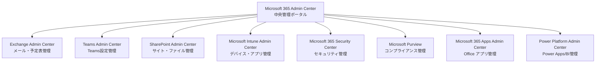
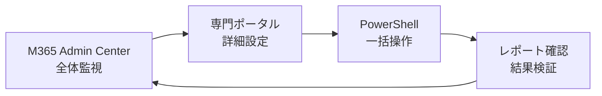

# 1.3 管理ポータルの種類

Microsoft 365では、様々な管理機能が複数のポータルに分散されています。この章では、IT管理者が日常的に使用する主要な管理ポータルの種類と役割について詳しく解説します。

## 📋 この章で学習すること

- Microsoft 365管理ポータルの全体像と関係性
- 各管理ポータルの役割と主要機能
- 管理ポータル間の使い分け方法
- アクセス権限と管理者ロールとの関係
- 2025年の最新情報と変更点

---

## 🏗️ Microsoft 365管理ポータル構成図



> 💡 **ポイント**: Microsoft 365 Admin Centerが中央ハブとなり、各専門ポータルへのゲートウェイの役割を果たします。

---

## 🌟 主要管理ポータル一覧

### **1. Microsoft 365 Admin Center（M365管理センター）**

**URL**: `https://admin.microsoft.com`

#### **役割と概要**
Microsoft 365の**中央管理ポータル**として、全体的な設定と監視を行う最も重要な管理画面です。

#### **主要機能**
- **ユーザー管理**: アカウント作成・削除、ライセンス割り当て
- **ライセンス管理**: サブスクリプション状況、使用量監視
- **全体設定**: 組織情報、ドメイン管理、セキュリティ設定
- **サービス正常性**: 各サービスの稼働状況確認
- **請求・支払い**: コスト管理、請求書確認

#### **対象者**
- グローバル管理者
- ユーザー管理者
- ライセンス管理者

> ⚠️ **2025年2月からの重要な変更**: Microsoft 365 Admin Centerへのアクセスには多要素認証（MFA）が必須となります。

#### **アクセス方法**
```
1. https://admin.microsoft.com にアクセス
2. 管理者アカウントでサインイン
3. MFA認証を完了（2025年2月以降必須）
4. ダッシュボードが表示される
```

---

### **2. Exchange Admin Center（EAC）**

**URL**: `https://admin.exchange.microsoft.com`

#### **役割と概要**
**メール・予定表・連絡先**に関する包括的な管理を行うポータルです。

#### **主要機能**
- **メールボックス管理**: 個人・共有・リソースメールボックス
- **メール配信**: 配信グループ、配信リスト管理
- **セキュリティ**: スパム対策、マルウェア対策
- **コンプライアンス**: 保持ポリシー、電子情報開示
- **メール フロー**: メールルール、コネクタ設定

#### **対象者**
- Exchange管理者
- メッセージング管理者
- グローバル管理者

#### **実務での使用例**
```powershell
# PowerShellでのEAC操作例
Connect-ExchangeOnline
Get-Mailbox -Identity "user@domain.com"
Set-Mailbox -Identity "user@domain.com" -ProhibitSendQuota 9.5GB
```

---

### **3. Microsoft Teams Admin Center**

**URL**: `https://admin.teams.microsoft.com`

#### **役割と概要**
**Microsoft Teams**の設定、ポリシー、使用状況を管理する専用ポータルです。

#### **主要機能**
- **会議ポリシー**: 会議設定、レコーディング権限
- **メッセージング ポリシー**: チャット、ファイル共有設定
- **アプリ管理**: Teamsアプリの許可・ブロック
- **電話システム**: Teams Phone、自動応答設定
- **レポート**: 使用状況、通話品質分析

#### **対象者**
- Teams管理者
- 通信管理者
- グローバル管理者

> 📋 **2025年7月の重要な変更**: 従来のTeams desktopアプリのサポートが終了し、新しいTeamsアプリへの移行が必要です。

---

### **4. SharePoint Admin Center**

**URL**: `https://admin.microsoft.com/sharepoint`

#### **役割と概要**
**SharePoint Online、OneDrive for Business**のサイト管理とストレージ管理を行います。

#### **主要機能**
- **サイト管理**: SharePointサイトの作成・削除・権限設定
- **ストレージ管理**: OneDriveストレージ容量、共有設定
- **外部共有**: ゲストアクセス、リンク共有ポリシー
- **情報ガバナンス**: 保持ラベル、DLP（データ損失防止）
- **検索設定**: 検索センター、コンテンツソース管理

#### **対象者**
- SharePoint管理者
- グローバル管理者

---

### **5. Microsoft Intune Admin Center**

**URL**: `https://intune.microsoft.com`

#### **役割と概要**
**デバイス管理（MDM）、アプリケーション管理（MAM）**を統合的に行う現代的なエンドポイント管理ポータルです。

#### **主要機能**
- **デバイス管理**: Windows、iOS、Android、macOSデバイス
- **アプリ管理**: アプリの配布、保護ポリシー
- **コンプライアンス**: デバイス準拠状況監視
- **条件付きアクセス**: デバイスベースのアクセス制御
- **セキュリティベースライン**: Windows セキュリティ設定

#### **対象者**
- Intune管理者
- デバイス管理者
- エンドポイント管理者

> 💡 **2025年12月の強化**: Windows 11デバイス向けハードウェアベース認証機能が追加予定です。

---

### **6. Microsoft 365 Security Center**

**URL**: `https://security.microsoft.com`

#### **役割と概要**
**セキュリティ監視、脅威検出、インシデント対応**を統合的に管理するセキュリティ運用の中核ポータルです。

#### **主要機能**
- **脅威分析**: リアルタイム脅威検出、攻撃動向分析
- **インシデント管理**: セキュリティアラート、対応ワークフロー
- **脅威探索**: 高度な検索、カスタムクエリ
- **セキュアスコア**: セキュリティ成熟度評価、改善提案
- **エンドポイント保護**: Microsoft Defender統合管理

#### **対象者**
- セキュリティ管理者
- セキュリティ オペレーター
- グローバル管理者

#### **2025年の新機能**
```
- Microsoft Security Copilot統合強化
- AI駆動の脅威検出精度向上
- 自動化されたインシデント対応機能
```

---

### **7. Microsoft Purview（旧Compliance Center）**

**URL**: `https://purview.microsoft.com`

#### **役割と概要**
**データガバナンス、コンプライアンス、プライバシー保護**を管理する統合ポータルです。

#### **主要機能**
- **データ分類**: 機密情報の自動分類・ラベリング
- **保持ポリシー**: データ保持・削除ルール
- **電子情報開示**: 法的調査、監査対応
- **内部リスク管理**: 不正アクセス、データ漏洩検出
- **情報保護**: DLP、暗号化ポリシー

#### **対象者**
- コンプライアンス管理者
- 電子情報開示管理者
- データ保護オフィサー

---

### **8. Microsoft 365 Apps Admin Center**

**URL**: `https://config.office.com`

#### **役割と概要**
**Office アプリケーション**の展開、更新、ポリシー管理を行う専用ポータルです。

#### **主要機能**
- **アプリ展開**: Office アプリのカスタマイズ展開
- **更新管理**: 更新チャネル、展開スケジュール
- **クラウドポリシー**: アプリケーション設定の一元管理
- **セキュリティポリシー**: マクロ、アドイン制御
- **使用状況分析**: アプリ利用状況レポート

#### **対象者**
- グローバル管理者
- Office アプリ管理者

---

### **9. Power Platform Admin Center**

**URL**: `https://admin.powerplatform.microsoft.com`

#### **役割と概要**
**Power Apps、Power BI、Power Automate**の統合管理を行うローコード/ノーコードプラットフォーム管理ポータルです。

#### **主要機能**
- **環境管理**: 開発・本番環境の分離管理
- **データポリシー**: データ接続、共有ルール
- **ライセンス管理**: Power Platform ライセンス配布
- **ガバナンス**: アプリ承認プロセス、監査
- **分析**: 使用状況、パフォーマンス監視

---

## 🔐 アクセス権限と管理者ロール

### **ロールベースアクセス制御（RBAC）**

| 管理者ロール | 主要アクセス先 | 権限範囲 |
|-------------|---------------|----------|
| **グローバル管理者** | すべてのポータル | 全権限・最高権限 |
| **Exchange管理者** | Exchange Admin Center | メール・予定表管理 |
| **Teams管理者** | Teams Admin Center | Teams設定・ポリシー |
| **SharePoint管理者** | SharePoint Admin Center | サイト・ストレージ管理 |
| **Intune管理者** | Intune Admin Center | デバイス・アプリ管理 |
| **セキュリティ管理者** | Security Center | セキュリティ設定・監視 |
| **コンプライアンス管理者** | Purview | データ保護・コンプライアンス |

> ⚠️ **セキュリティのベストプラクティス**: 
> - グローバル管理者アカウントは最小限に制限
> - 日常業務には専門管理者ロールを使用
> - すべての管理者アカウントでMFAを有効化

---

## 🌐 ポータル間の連携と使い分け

### **日常的な管理作業フロー**



### **実務での使い分け例**

#### **ユーザー追加作業**
```
1. M365 Admin Center → ユーザー作成・ライセンス割り当て
2. Exchange Admin Center → メールボックス詳細設定
3. Teams Admin Center → Teams ポリシー適用
4. Intune Admin Center → デバイス登録準備
```

#### **セキュリティインシデント対応**
```
1. Security Center → アラート確認・初期対応
2. Purview → データ影響範囲調査
3. M365 Admin Center → 影響ユーザー特定・対処
4. 各専門ポータル → 詳細設定変更
```

---

## 📱 モバイル管理とリモートアクセス

### **Microsoft 365 Admin Mobile App**

**主要機能**:
- サービス正常性監視
- ユーザー管理（追加・削除・パスワードリセット）
- ライセンス割り当て
- サポートリクエスト作成

**対応プラットフォーム**: iOS、Android

```
ダウンロード:
- iOS: App Store "Microsoft 365 Admin"
- Android: Google Play "Microsoft 365 Admin"
```

---

## 🔮 2025年の主要変更点と今後の展望

### **2025年に予定されている主要変更**

| 時期 | 変更内容 | 影響範囲 |
|------|----------|----------|
| **2月** | MFA必須化（M365 Admin Center） | 全管理者 |
| **7月** | Teams Classic アプリ退役 | Teams ユーザー |
| **10月** | Office 2016/2019 サポート終了 | レガシー Office ユーザー |
| **12月** | Intune ハードウェア認証強化 | Windows 11 デバイス |

### **AI・Copilot 統合の進展**

#### **Microsoft 365 Copilot 管理機能**
```
- AIアシスタント設定の一元管理
- 利用状況分析とガバナンス
- カスタムCopilot作成・配布
- セキュリティ・プライバシー制御
```

#### **新しいAI管理者ロール**
**AI管理者ロール**: Microsoft 365 Admin Center内でCopilot関連の設定を一元管理する専用ロールが新設されています。

---

## 🛠️ 実践的な管理ポータル活用方法

### **効率的な日常管理ルーチン**

#### **毎日実施する監視項目**
```markdown
□ Service Health Dashboard確認（M365 Admin Center）
□ セキュリティアラート確認（Security Center）
□ 新規ユーザーリクエスト処理（M365 Admin Center）
□ サポートチケット対応状況確認
```

#### **週次実施項目**
```markdown
□ ライセンス使用状況レビュー（M365 Admin Center）
□ Teams会議品質レポート確認（Teams Admin Center）
□ セキュリティスコア確認・改善（Security Center）
□ コンプライアンス状況確認（Purview）
```

#### **月次実施項目**
```markdown
□ 全体使用状況レポート生成（各ポータル）
□ セキュリティポリシー見直し（Security Center）
□ デバイス コンプライアンス確認（Intune）
□ ストレージ使用量確認（SharePoint Admin Center）
```

### **トラブルシューティング時のポータル活用**

#### **問題分類別対応ポータル**

| 問題の種類 | 主要確認ポータル | 確認項目 |
|------------|------------------|----------|
| **メール不達** | Exchange Admin Center | メールフロー、スパムフィルター |
| **Teams接続問題** | Teams Admin Center | 通話品質、ネットワーク |
| **ファイルアクセス問題** | SharePoint Admin Center | 権限設定、外部共有 |
| **デバイス同期問題** | Intune Admin Center | デバイス状態、ポリシー適用 |
| **セキュリティアラート** | Security Center | 脅威詳細、対応履歴 |

---

## 📚 参考リソース・関連リンク

### **公式ドキュメント**
- [Microsoft 365 管理者向けヘルプ](https://docs.microsoft.com/microsoft-365/admin/)
- [Exchange Online 管理](https://docs.microsoft.com/exchange/exchange-online)
- [Teams 管理者ドキュメント](https://docs.microsoft.com/microsoftteams/)

### **便利なブックマーク一覧**
```markdown
# 日常管理用ブックマーク
- M365 Admin Center: https://admin.microsoft.com
- Service Health: https://admin.microsoft.com/adminportal/home#/servicehealth
- Message Center: https://admin.microsoft.com/adminportal/home#/MessageCenter
- Security Center: https://security.microsoft.com
- Teams Admin: https://admin.teams.microsoft.com
```

### **管理者向けトレーニング**
- Microsoft Learn: Microsoft 365 管理者ラーニングパス
- Microsoft 365 認定試験: MS-100, MS-101
- Microsoft FastTrack サポート

---

## ✅ チェックリスト：管理ポータル準備確認

### **初期セットアップ完了確認**
```markdown
□ すべての管理ポータルへのアクセス確認
□ 適切な管理者ロール割り当て完了
□ MFA設定完了（全管理者アカウント）
□ モバイルアプリインストール・設定完了
□ 緊急時連絡先・エスカレーション手順確認
□ 定期監視・レポートスケジュール設定
□ バックアップ管理者アカウント設定
□ PowerShell接続設定・テスト完了
```

---

> 💡 **次のステップ**: 第2章「初期セットアップ」では、これらの管理ポータルを使用して実際にMicrosoft 365テナントの基本設定を行います。

---

**関連章**:
<!-- 以下のリンクは未実装 -->
<!-- - [第2章: 初期セットアップ](../02-initial-setup/02-00-m365_initial_setup_readme.md) -->
<!-- - [第3章: ユーザー管理](../03-user-management/03-00-m365_user_management.md) -->
<!-- - [付録: 重要なURL一覧](../../appendices/important-urls.md) -->