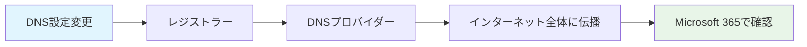

# 2.3 カスタムドメインの追加

## 📖 この章で学習すること

- Microsoft 365でカスタムドメインを使用する意義と重要性
- ドメイン追加の具体的な手順と操作方法
- DNS設定の基本概念と実践的な設定方法
- ドメイン検証プロセスとトラブルシューティング

## 🎯 なぜカスタムドメインが必要なのか

Microsoft 365では、初期状態で `your-organization.onmicrosoft.com` という形式のドメインが自動的に提供されます。しかし、実際の業務運用では以下の理由から**独自ドメイン**（カスタムドメイン）の使用が強く推奨されます。

### **ビジネス上の利点**

- **ブランド信頼性の向上**: `tanaka@yourschool.ac.jp` のような独自ドメインは、`tanaka@yourschool.onmicrosoft.com` より信頼感を与える
- **メール配信性の改善**: 独自ドメインはスパムフィルターを通過しやすく、重要なメールが確実に届く
- **統一されたブランディング**: 既存のWebサイトと同じドメインを使用することで、組織の一体感を演出

### **技術的な利点**

- **柔軟なユーザー管理**: 組織の命名規則に合わせたメールアドレス体系の構築
- **長期的な可搬性**: 将来的にサービスを変更する際も、ドメインを維持可能
- **高度な機能の活用**: SPF、DKIM、DMARCなどのメールセキュリティ機能が利用可能

> 💡 **教育機関の場合**: `.ac.jp` ドメインの使用により、教育機関としての正当性と信頼性を示すことができます。

---

## 🔧 前提条件の確認

カスタムドメインの追加を始める前に、以下の要件を満たしていることを確認してください。

### **必要な権限・アクセス**

| 項目 | 要件 | 確認方法 |
|------|------|----------|
| **Microsoft 365権限** | グローバル管理者またはドメイン名管理者 | 管理センターで権限確認 |
| **ドメイン所有権** | 追加したいドメインの所有者 | レジストラーでの登録情報確認 |
| **DNS管理権限** | ドメインのDNSレコード編集権限 | DNSプロバイダーへのアクセス確認 |

### **技術的な準備事項**

```markdown
✅ チェックリスト
□ 追加するドメイン名の決定（例：yourschool.ac.jp）
□ ドメインレジストラーの管理画面へのアクセス情報
□ DNSプロバイダーの管理画面へのアクセス情報
□ 現在のDNS設定のバックアップ（推奨）
□ 作業時間の確保（初回は90分程度を見込む）
```

> ⚠️ **重要**: ドメイン追加作業中は一時的にメールサービスが影響を受ける場合があります。メンテナンス時間帯での作業を推奨します。

---

## 📚 DNS設定の基本概念

カスタムドメインの設定を理解するために、必要最小限のDNS知識を確認しましょう。

### **主要なDNSレコードタイプ**

| レコードタイプ | 役割 | Microsoft 365での用途 | 設定例 |
|----------------|------|----------------------|--------|
| **TXT** | テキスト情報の記録 | ドメイン所有権の証明、SPF設定 | `v=spf1 include:spf.protection.outlook.com` |
| **MX** | メールサーバーの指定 | Exchange Onlineへのメール配信 | `yourschool-edu-jp.mail.protection.outlook.com` |
| **CNAME** | 別名の設定 | Autodiscoverなどの自動設定 | `autodiscover.outlook.com` |
| **SRV** | サービス情報の記録 | Teams、Skypeなどの接続設定 | `sipdir.online.lync.com` |

### **DNS伝播について**



**DNS伝播時間**: 通常15分〜48時間（多くの場合、30分以内に完了）

---

## 🚀 カスタムドメイン追加の実践手順

### **ステップ1: Microsoft 365管理センターでのドメイン追加開始**

1. **Microsoft 365管理センターにアクセス**
   ```
   URL: https://admin.microsoft.com
   ```

2. **ドメイン追加の開始**
   - 左側ナビゲーションメニューで **「設定」** をクリック
   - **「ドメイン」** を選択
   - **「ドメインを追加」** ボタンをクリック

3. **ドメイン名の入力**
   ```
   例: yourschool.ac.jp
   ```
   - 追加したいドメイン名を正確に入力
   - **「このドメインを使用する」** をクリック

> 📋 **操作のポイント**: ドメイン名には www. などのサブドメインは含めず、ルートドメインを入力してください。

### **ステップ2: ドメイン所有権の確認**

Microsoft 365では、ドメインの悪用を防ぐため、ドメインの所有権確認が必須です。

1. **確認方法の選択**
   - **TXTレコード追加**（推奨）: 最も確実で標準的な方法
   - **MXレコード追加**: メール中心の運用の場合

2. **TXTレコード情報の確認**
   ```
   レコードタイプ: TXT
   ホスト名: @ または yourschool.ac.jp
   値: MS=ms12345678（Microsoft 365が生成する一意の値）
   TTL: 3600（推奨）
   ```

3. **DNSプロバイダーでの設定実施**

### **ステップ3: DNSプロバイダーでのTXTレコード追加**

#### **お名前.com での設定例**

1. **お名前.com Navi にログイン**
2. **DNS設定 > DNSレコード設定** を選択
3. **新しいレコードの追加**:
   ```
   ホスト名: 空欄（@と同じ意味）
   TYPE: TXT
   VALUE: MS=ms12345678（Microsoft 365画面に表示された値をコピー）
   TTL: 3600
   ```

#### **さくらインターネットでの設定例**

1. **さくらのドメインコントロールパネル** にログイン
2. **ドメイン名をクリック > ゾーン編集**
3. **新しいエントリを追加**:
   ```
   名前: 空欄
   タイプ: TXT
   データ: MS=ms12345678
   ```

#### **CloudFlareでの設定例**

1. **CloudFlare Dashboard** にログイン
2. **該当ドメインを選択 > DNS > Records**
3. **Add record**:
   ```
   Type: TXT
   Name: @
   Content: MS=ms12345678
   TTL: Auto
   ```

#### **Azure DNSでの設定例**

1. **Azure Portal** にログイン
2. **DNSゾーン > 該当ドメインを選択**
3. **+ レコード セット**:
   ```
   名前: 空欄（@と同じ意味）
   種類: TXT
   値: MS=ms12345678
   TTL: 3600
   ```

### **ステップ4: ドメイン所有権の確認実行**

1. **Microsoft 365管理センターに戻る**
2. **「確認」** ボタンをクリック
3. **確認結果の待機**（通常15分〜1時間）

**確認が成功した場合**:
```
✅ ドメイン yourschool.ac.jp の所有権が確認されました
```

**確認が失敗した場合**:
```
❌ 確認できませんでした。DNS設定を再確認してください。
```

> ⚠️ **確認が失敗する主な原因**:
> - DNS設定の反映待ち（時間を置いて再試行）
> - TXTレコード値の入力ミス
> - ホスト名設定の誤り（@の代わりにドメイン名を入力など）

### **ステップ5: Microsoft 365サービスの設定**

ドメインの所有権確認が完了すると、Microsoft 365の各サービスで使用するための設定に進みます。

1. **使用するサービスの選択**
   - ✅ **Exchange Online**（メール機能）
   - ✅ **Microsoft Teams**（チャット・会議機能）
   - ✅ **SharePoint Online**（ファイル共有・サイト機能）
   - ✅ **Mobile Device Management**（デバイス管理機能）

2. **必要なDNSレコードの確認**

Microsoft 365が自動的に以下のDNSレコード設定を要求します：

#### **Exchange Online用 DNSレコード**

```
【MXレコード】
ホスト名: @
値: yourschool-edu-jp.mail.protection.outlook.com
優先度: 0
TTL: 3600

【CNAMEレコード】
ホスト名: autodiscover
値: autodiscover.outlook.com
TTL: 3600

【TXTレコード（SPF）】
ホスト名: @
値: v=spf1 include:spf.protection.outlook.com -all
TTL: 3600
```

#### **Teams/Skype for Business用 DNSレコード**

```
【SRVレコード】
サービス: _sip
プロトコル: _tls
ポート: 443
ホスト名: sipdir.online.lync.com
優先度: 100
重み: 1
TTL: 3600

【SRVレコード】
サービス: _sipfederationtls
プロトコル: _tcp
ポート: 5061
ホスト名: sipfed.online.lync.com
優先度: 100
重み: 1
TTL: 3600
```

### **ステップ6: DNSレコードの一括設定**

各DNSプロバイダーで、Microsoft 365が要求するすべてのレコードを設定します。

#### **設定作業のベストプラクティス**

1. **設定前の確認**
   ```bash
   # 現在のMXレコード確認（Windows PowerShell）
   Resolve-DnsName -Name yourschool.ac.jp -Type MX
   
   # 現在のTXTレコード確認
   Resolve-DnsName -Name yourschool.ac.jp -Type TXT
   ```

2. **段階的な設定**
   - まずテスト用のTXTレコードで動作確認
   - MXレコード変更は最後に実施（メール配信への影響を最小化）

3. **設定完了後の確認**
   ```bash
   # MXレコードの確認
   nslookup -type=MX yourschool.ac.jp
   
   # TXTレコードの確認
   nslookup -type=TXT yourschool.ac.jp
   ```

### **ステップ7: Microsoft 365での最終確認**

1. **Microsoft 365管理センターに戻る**
2. **「続行」** または **「確認」** をクリック
3. **すべてのDNSレコードの確認実行**

**成功時の表示**:
```
✅ yourschool.ac.jp の設定が完了しました
✅ Exchange Online - 設定完了
✅ Microsoft Teams - 設定完了
✅ SharePoint Online - 設定完了
```

---

## 🔍 設定確認とテスト方法

### **基本的な動作確認**

#### **1. メール送受信テスト**

1. **テストユーザーの作成**
   - 管理センター > **ユーザー** > **アクティブなユーザー** > **ユーザーの追加**
   - メールアドレス: `test-user@yourschool.ac.jp`

2. **送信テスト**
   ```
   差出人: test-user@yourschool.ac.jp
   宛先: 外部のメールアドレス（Gmail等）
   件名: [テスト] Microsoft 365 カスタムドメイン設定確認
   ```

3. **受信テスト**
   ```
   差出人: 外部のメールアドレス
   宛先: test-user@yourschool.ac.jp
   件名: [テスト] 外部からの受信確認
   ```

#### **2. AutodiscoverとActiveSync確認**

```powershell
# Autodiscoverの動作確認
Test-OutlookConnectivity -ProbeIdentity OutlookAutoDiscover -MailboxId test-user@yourschool.ac.jp

# ActiveSync接続確認
Test-ActiveSyncConnectivity -MailboxId test-user@yourschool.ac.jp
```

#### **3. SPFレコードの検証**

オンラインツールでSPF設定を確認：

```
確認サイト例:
- MXToolbox SPF Record Lookup
- DMARC Analyzer SPF Checker

確認項目:
✅ SPFレコードが存在する
✅ include:spf.protection.outlook.com が含まれている
✅ -all で終わっている（厳格なポリシー）
```

---

## ⚠️ よくあるトラブルと対処法

### **問題1: ドメイン所有権確認に失敗する**

**症状**:
```
エラー: ドメインの所有権を確認できませんでした
```

**原因と対処法**:

| 原因 | 対処法 |
|------|--------|
| DNS伝播待ち | 24時間後に再試行 |
| TXTレコード値の誤り | Microsoft 365画面から値を再コピー |
| ホスト名設定ミス | '@' または空欄、場合によってはドメイン名 |
| TTL設定が長すぎる | TTL値を300-3600に変更 |

**確認コマンド**:
```powershell
# TXTレコードの確認
nslookup -type=TXT yourschool.ac.jp

# 期待される応答例
# yourschool.ac.jp text = "MS=ms12345678"
```

### **問題2: メールが送受信できない**

**症状**:
```
送信エラー: 550 5.7.1 Message rejected due to SPF failure
受信なし: 外部からのメールが届かない
```

**段階的な診断手順**:

1. **MXレコードの確認**
   ```powershell
   nslookup -type=MX yourschool.ac.jp
   
   # 期待される応答
   # yourschool.ac.jp mail exchanger = 0 yourschool-edu-jp.mail.protection.outlook.com
   ```

2. **SPFレコードの確認**
   ```powershell
   nslookup -type=TXT yourschool.ac.jp
   
   # 期待される応答例
   # "v=spf1 include:spf.protection.outlook.com -all"
   ```

3. **Exchange Online接続確認**
   ```powershell
   # Exchange Online PowerShellで接続テスト
   Test-MAPIConnectivity -Identity test-user@yourschool.ac.jp
   ```

### **問題3: Teams/Skype接続ができない**

**症状**:
```
Teams会議への参加時にエラー
外部組織とのフェデレーション接続不可
```

**対処法**:

1. **SRVレコードの確認**
   ```powershell
   nslookup -type=SRV _sip._tls.yourschool.ac.jp
   nslookup -type=SRV _sipfederationtls._tcp.yourschool.ac.jp
   ```

2. **Microsoft 365でのTeams設定確認**
   - Teams管理センター > **組織全体の設定** > **外部アクセス**
   - フェデレーション設定の有効化確認

### **問題4: DNS設定の競合エラー**

**症状**:
```
エラー: 既存のMXレコードと競合しています
```

**解決手順**:

1. **既存レコードの確認と削除**
   ```powershell
   # 既存のMXレコード確認
   nslookup -type=MX yourschool.ac.jp
   ```

2. **段階的な移行計画**
   ```markdown
   Phase 1: 現在のメールサーバーを維持しつつ、Microsoft 365用レコード追加
   Phase 2: メールボックス移行完了後、MXレコード変更
   Phase 3: 旧メールサーバーのレコード削除
   ```

---

## 📊 運用開始後の管理・監視

### **日常的な監視項目**

#### **1. メール配信状況の監視**

**Microsoft 365管理センターでの確認**:
- **レポート** > **メール** > **メール フロー**
- 送信失敗、遅延、スパム検出の状況を定期確認

**監視すべき指標**:
```
✅ 送信成功率: 95%以上
✅ 平均配信時間: 5分以内
✅ スパム誤検知率: 1%以下
⚠️ バウンス率: 5%以下
```

#### **2. DNS設定の整合性確認**

**月次確認項目**:
```powershell
# 定期的なDNS確認スクリプト例
$domain = "yourschool.ac.jp"

# MXレコード確認
$mx = Resolve-DnsName -Name $domain -Type MX
Write-Host "MX Record: $($mx.NameExchange)"

# SPFレコード確認
$spf = Resolve-DnsName -Name $domain -Type TXT | Where-Object {$_.Strings -like "*spf*"}
Write-Host "SPF Record: $($spf.Strings)"

# AutodiscoverのCNAME確認
$autodiscover = Resolve-DnsName -Name "autodiscover.$domain" -Type CNAME
Write-Host "Autodiscover: $($autodiscover.NameHost)"
```

### **セキュリティ強化設定**

#### **1. DKIM（DomainKeys Identified Mail）の有効化**

```powershell
# Exchange Online PowerShell接続
Connect-ExchangeOnline

# DKIMの有効化
New-DkimSigningConfig -DomainName "yourschool.ac.jp" -Enabled $true

# DKIM設定確認
Get-DkimSigningConfig -Identity "yourschool.ac.jp"
```

#### **2. DMARC（Domain-based Message Authentication）設定**

```
DNSレコード追加:
ホスト名: _dmarc
タイプ: TXT
値: v=DMARC1; p=quarantine; rua=mailto:dmarc-report@yourschool.ac.jp; pct=100
```

#### **3. 定期的なセキュリティ監査**

**四半期ごとの確認事項**:
- [ ] 管理者権限の見直し
- [ ] 不要なDNSレコードの削除
- [ ] セキュリティ設定の最新化
- [ ] メール配信レポートの分析

---

## 📋 運用チェックリスト

### **カスタムドメイン追加完了チェックリスト**

```markdown
□ ドメイン所有権確認の完了
□ 全必要DNSレコードの設定完了
□ Microsoft 365での動作確認完了
□ テストメールの送受信成功
□ Autodiscover機能の動作確認
□ Teams/Skype接続の動作確認
□ セキュリティ設定（SPF/DKIM/DMARC）の完了
□ ユーザーへの新ドメイン利用案内
□ 旧onmicrosoft.comドメインでの管理者アカウント維持
□ 運用監視体制の確立
```

### **トラブル時の緊急対応チェックリスト**

```markdown
メール送受信障害時:
□ Microsoft 365サービス正常性確認
□ DNSレコード設定の再確認
□ Exchange Online接続テスト実行
□ 影響範囲の特定（全ユーザー/特定ユーザー）
□ 暫定的な代替手段の検討
□ ユーザーへの障害報告とサポート案内

DNS設定変更時:
□ 変更前の設定バックアップ
□ 変更内容の動作検証
□ 段階的な変更実施
□ 変更後の動作確認テスト
□ 問題発生時のロールバック手順確認
```

---

## 🔗 関連リソース・参考文献

### **Microsoft公式ドキュメント**
- [Microsoft 365にドメインを追加する - Microsoft Learn](https://learn.microsoft.com/ja-jp/microsoft-365/admin/setup/add-domain)
- [DNS レコードの更新 - Microsoft Learn](https://learn.microsoft.com/ja-jp/microsoft-365/admin/get-help-with-domains/create-dns-records-at-any-dns-hosting-provider)
- [よく寄せられる質問のドメイン - Microsoft Learn](https://learn.microsoft.com/ja-jp/microsoft-365/admin/setup/domains-faq)

### **実用的なツール**
- [MX Toolbox](https://mxtoolbox.com/) - DNS設定の確認・診断
- [DMARC Analyzer](https://www.dmarcanalyzer.com/) - メール認証設定の確認
- [Microsoft Remote Connectivity Analyzer](https://testconnectivity.microsoft.com/) - Exchange接続の詳細テスト

### **DNS プロバイダー別設定ガイド**
- [お名前.com DNS設定ガイド](https://help.onamae.com/answer/7883)
- [さくらインターネット ゾーン編集ガイド](https://help.sakura.ad.jp/domain/2150/)
- [CloudFlare DNS設定ガイド](https://developers.cloudflare.com/dns/)
- [Azure DNS 設定ガイド](https://learn.microsoft.com/ja-jp/azure/dns/dns-getstarted-portal)

### **PowerShellコマンド集**
```powershell
# よく使用するMicrosoft 365 PowerShellコマンド
Connect-ExchangeOnline                                    # Exchange Online接続
Get-AcceptedDomain                                        # 受け入れドメイン一覧
Test-MAPIConnectivity -Identity user@domain.com          # MAPI接続テスト
Get-MessageTrace -RecipientAddress user@domain.com       # メール配信追跡
```

---

## 🎯 次のステップ

カスタムドメインの設定が完了したら、以下の章に進んでMicrosoft 365の運用を本格化しましょう。

- **[第3章: ユーザー管理](../03-user-management/03-00-m365_user_management.md)** - 新しいドメインを使用したユーザー追加
<!-- - **[第4章: ライセンス管理](../04-license-management/README.md)** --> - ユーザーへのライセンス適切な割り当て
<!-- - **[第5章: セキュリティとコンプライアンス](../05-security-compliance/README.md)** --> - ドメインレベルでのセキュリティ強化

> 💡 **運用のコツ**: カスタムドメイン設定後は、段階的にユーザーを移行し、各段階で動作確認を行うことで、トラブルの早期発見・解決が可能になります。

---

*最終更新: 2025年6月1日*