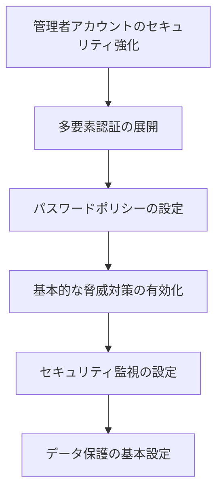
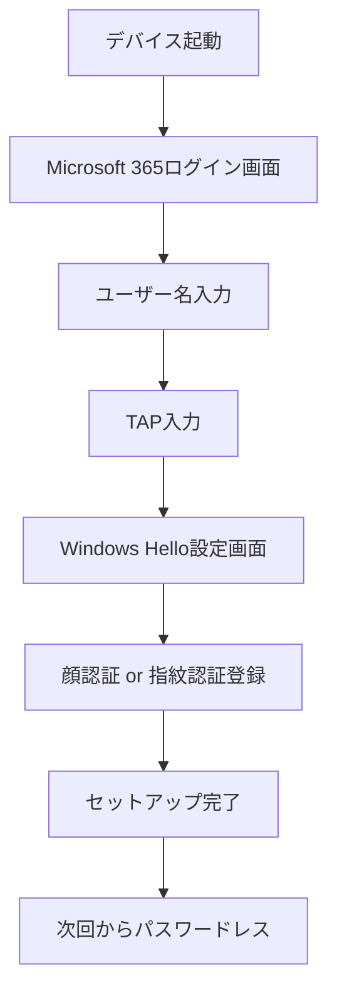
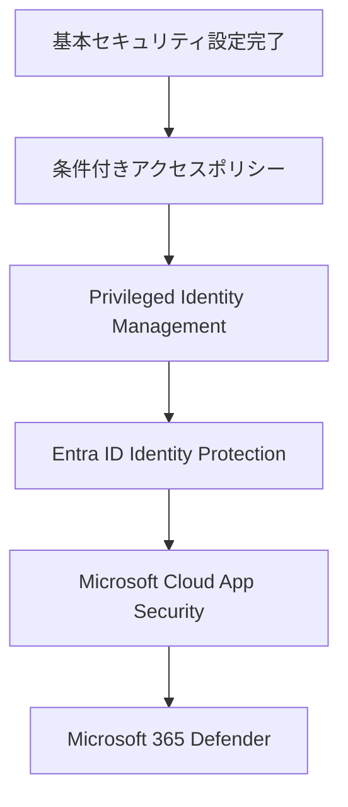

# 2.4 セキュリティの基本設定

<!---

**章**: 第2章 初期セットアップ  
**セクション**: 2.4  
**難易度**: ★★★  
**所要時間**: 120分  
**前提条件**: グローバル管理者権限、カスタムドメイン設定完了  
**最終更新**: 2025年6月1日  

-->

## 📖 この章で学習すること

Microsoft 365環境において、**セキュリティ侵害を防ぐための基本的な設定**を行います。適切なセキュリティ基盤を構築することで、組織のデータと利用者を保護し、安全にMicrosoft 365を運用できるようになります。

### 学習目標
- Microsoft 365セキュリティの基本概念を理解する
- 管理者アカウントのセキュリティを強化する
- 多要素認証（MFA）を組織全体に展開する
- パスワードポリシーを適切に設定する
- セキュリティ監視とレポート機能を活用する

> 💡 **重要**: セキュリティ設定は段階的に実施することをお勧めします。一度にすべてを変更すると、利用者の混乱や業務への影響が生じる可能性があります。

---

## 🎯 Microsoft 365セキュリティの基本概念

### セキュリティの3つの柱

Microsoft 365のセキュリティは、以下の3つの柱で構成されています。

1. **ID・アクセス管理 (Identity & Access Management)**
   - ユーザー認証の強化
   - アクセス権限の適切な管理
   - 不正アクセスの検知・防止

2. **脅威対策 (Threat Protection)**
   - マルウェア・フィッシング対策
   - 疑わしい活動の検知
   - インシデント対応

3. **情報保護 (Information Protection)**
   - データの分類・ラベリング
   - 機密情報の漏洩防止
   - データ損失防止（DLP）

### セキュリティ設定の優先順位

初期設定では、以下の順序でセキュリティを強化していきます：



---

## 🔐 1. 管理者アカウントのセキュリティ強化

### 1.1 専用管理者アカウントの作成

**目的**: 日常業務と管理業務を分離し、管理者権限の悪用リスクを軽減します。

#### 手順

1. **Microsoft 365管理センター**（https://admin.microsoft.com）にアクセス
2. **ユーザー** → **アクティブなユーザー** をクリック
3. **ユーザーを追加** を選択

#### 専用管理者アカウントの設定例

| 項目 | 設定値 | 説明 |
|------|--------|------|
| **表示名** | IT管理者_田中 | 個人名ではなく役割を示す名前 |
| **ユーザー名** | itadmin-tanaka@school.ac.jp | 管理者であることが分かる命名 |
| **パスワード** | 複雑なパスワード（20文字以上） | 後述のパスワードポリシーに準拠 |
| **ライセンス** | Microsoft 365 A3/E3以上 | セキュリティ機能を含むライセンス |

4. **ロールの割り当て**で以下のいずれかを選択：
   - **グローバル管理者**: 全ての管理権限（最小限の人数に限定）
   - **Exchange管理者**: メール関連の管理
   - **Teams管理者**: Teams関連の管理
   - **SharePoint管理者**: SharePoint関連の管理

> ⚠️ **重要**: グローバル管理者の数は組織全体で2-5名程度に制限することを強く推奨します。権限の最小化原則に基づき、業務に必要な最小限の権限のみを付与してください。

### 1.2 既存管理者アカウントの棚卸し

1. **Microsoft Entra ID管理センター** [https://entra.microsoft.com/#home](https://entra.microsoft.com/#home) にアクセス
2. **ロールと管理者** → **すべてのロール** をクリック
3. **グローバル管理者** をクリックして、現在の管理者一覧を確認

#### チェックポイント
- [ ] 退職者のアカウントが管理者権限を持っていないか
- [ ] 必要以上に多くの人がグローバル管理者になっていないか
- [ ] 管理者アカウントが適切に保護されているか

---

## 🛡️ 2. 多要素認証（MFA）の設定

### 2.1 MFAとは

**多要素認証（Multi-Factor Authentication: MFA）** とは、パスワードに加えて、以下のような複数の認証要素を組み合わせる認証方法です。

- **知っているもの**: パスワード、PIN
- **持っているもの**: スマートフォン、ハードウェアトークン
- **自分自身**: 指紋、顔認証

### 2.2 セキュリティ既定値群の有効化

**最も簡単なMFA導入方法** として、セキュリティ既定値群を使用します。

#### 手順

1. **Microsoft Entra ID 管理センター**　(https://entra.microsoft.com/#home) にアクセス
2. **プロパティ** をクリック
3. **セキュリティ既定値群の管理** をクリック
4. **セキュリティ既定値群の有効化** を **はい** に設定
5. **保存** をクリック

#### セキュリティ既定値群で自動的に有効になる機能

| 機能 | 対象 | 効果 |
|------|------|------|
| **管理者MFA** | 全ての管理者 | 14日以内にMFA登録必須 |
| **ユーザーMFA** | 全てのユーザー | リスクが検出された場合にMFA要求 |
| **レガシー認証ブロック** | 全てのユーザー | 古い認証プロトコルをブロック |
| **Azure portal保護** | 管理者 | Azureポータルアクセス時にMFA要求 |

> 💡 **ヒント**: セキュリティ既定値群は小規模組織（300名以下）に最適です。より柔軟な設定が必要な場合は、条件付きアクセスポリシーを使用します。

### 2.3 MFAメソッドの管理

#### 推奨MFAメソッドの優先順位

1. **Microsoft Authenticator アプリ（プッシュ通知）** - 最も安全で使いやすい
2. **Microsoft Authenticator アプリ（確認コード）** - ネットワーク接続不要
3. **SMS認証** - スマートフォンで利用可能
4. **音声通話** - 固定電話でも利用可能

#### 組織全体のMFAメソッド設定

1. **Microsoft Entra ID 管理センター** → **セキュリティ** → **MFA** → **追加のクラウドベースのMFA設定** をクリック
2. **MFAメソッド**タブで利用可能な認証方法を選択：

```
☑ Microsoft Authenticatorアプリの通知
☑ Microsoft Authenticatorアプリまたはハードウェアトークンの確認コード
☑ 音声による電話
☑ 携帯電話へのテキストメッセージ
```

3. **保存** をクリック

### 2.4 教育機関における認証戦略

#### 教職員と児童生徒の認証方法の使い分け

教育現場では、利用者の年齢や使用環境を考慮した認証方法の選択が重要です。

| 利用者 | 推奨認証方法 | 理由 |
|--------|-------------|------|
| **教職員** | 多要素認証（MFA） | 重要性分類Ⅱ以上の情報へのアクセスが多い |
| **中学生** | パスワードレス認証 | デバイス操作に慣れており、セキュリティと利便性を両立 |
| **小学生** | パスワードレス認証 | パスワード管理が困難、生体認証が直感的 |

> 💡 **文科省ガイドライン準拠**: 児童生徒は「パスワードの複雑性等を確保することでID・パスワード認証を許容」とされていますが、より安全で使いやすいパスワードレス認証を推奨します。

#### パスワードレス認証のメリット

**児童生徒にとってのメリット**:
- パスワードを覚える必要がない
- 顔認証・指紋認証で直感的にログイン
- パスワードの紛失や忘却によるトラブルが解消

**学校運営面でのメリット**:
- パスワードリセット依頼の大幅削減
- より強固なセキュリティの実現
- 管理負荷の軽減

### 2.5 パスワードレス認証の設定

#### 前提条件

- Windows 10/11 デバイス（Windows Hello対応）
- Entra ID  Premium P1 以上のライセンス
- 生体認証センサー（指紋・顔認証カメラ）搭載デバイス

#### 手順1: パスワードレス認証ポリシーの有効化

1. **Microsoft Entra ID 管理センター**（https://aad.portal.azure.com）にアクセス
2. **セキュリティ** → **認証方法** → **ポリシー** をクリック
3. **Microsoft Authenticator** を選択し、以下を設定：

```
対象: 児童生徒グループ
認証モード: パスワードレス
プッシュ通知: 有効
表示場所情報: 有効
表示アプリケーション名: 有効
```

#### 手順2: Temporary Access Pass（TAP）の設定

**TAPとは**: パスワードレス認証の初期設定時に使用する一時的なパスコードです。

1. **Microsoft Entra ID 管理センター** → **セキュリティ** → **認証方法** → **Temporary Access Pass** をクリック
2. 以下の設定を行います。

| 設定項目 | 推奨値 | 説明 |
|----------|--------|------|
| **有効化** | はい | 機能を有効にする |
| **対象ユーザー** | 児童生徒グループ | 対象を限定 |
| **最小有効期間** | 10分 | セットアップに必要な時間 |
| **最大有効期間** | 60分 | セキュリティ重視 |
| **既定の有効期間** | 30分 | バランスの取れた設定 |
| **ワンタイム使用** | はい | 再利用を防止 |
| **パスコードの長さ** | 8文字 | 覚えやすく安全 |

#### 手順3: 児童生徒用TAPの発行

各児童生徒にTAPを発行します。

1. **Microsoft Entra ID 管理センター** → **ユーザー** → **すべてのユーザー** をクリック
2. 対象の児童生徒を選択
3. **認証方法** をクリック
4. **+ Temporary Access Pass の追加** をクリック
5. 必要に応じて有効期間を調整（既定30分）

#### 手順4: 児童生徒向けセットアップ手順

**初回ログイン時の流れ**:



**1. 初回ログイン**:
```
1. デバイスを起動
2. 学校から配布されたユーザー名を入力
3. 一時パスコード（TAP）を入力
4. 「Windows Helloのセットアップ」が表示される
```

**2. 生体認証の登録**:
```
顔認証の場合:
- カメラに向かって顔を登録
- 角度を変えて複数回撮影

指紋認証の場合:
- 指紋センサーに指を置く
- 指の角度を変えて複数回登録
```

**3. セットアップ完了確認**:
```
- Windows Helloアイコンが表示される
- 次回ログインでパスワードレス認証が可能
```

### 2.6 導入時の運用ガイド

#### 段階的展開計画

**Phase 1: パイロット導入（1〜2クラス）**
- 担任教師と連携してセットアップ支援
- 問題点の洗い出しと対策検討

**Phase 2: 学年単位展開**
- パイロット結果を踏まえた改善
- 教職員向け操作研修の実施

**Phase 3: 全校展開**
- 学年ごとの順次展開
- トラブル対応体制の整備

#### 児童生徒・保護者への案内例

```markdown
【重要】新しいログイン方法について

◆保護者の皆様

お子様のタブレット・PCログイン方法が、より安全で簡単な方式に変わります。

【変更内容】
・パスワード入力 → 顔認証・指紋認証
・忘れる心配がなく、より安全です

【セットアップ日程】
○月○日（○曜日）1時間目
※担任の先生がサポートいたします

【ご家庭でのお願い】
・デバイスの顔認証・指紋認証は学習専用です
・兄弟姉妹での共用はしないようご指導ください

【お問い合わせ】
学校IT担当: xxx-xxxx-xxxx
```

### 2.7 トラブルシューティング

#### よくある問題と対処法

**問題1: 顔認証がうまく機能しない**

**原因と対処法**:
```
原因1: 照明条件が悪い
→ 明るい場所でのセットアップを案内

原因2: カメラの汚れ
→ 柔らかい布でカメラレンズを清拭

原因3: 登録時と髪型・眼鏡が大きく異なる
→ Windows Hello設定で顔認証を再登録
```

**問題2: 指紋認証が反応しない**

**確認項目**:
- [ ] 指紋センサーの清掃状況
- [ ] 指の乾燥・湿り具合
- [ ] 登録した指と認証時の指が同じか

**問題3: TAPの有効期限が切れた**

**対処手順**:
1. Entra ID 管理センターで新しいTAPを発行
2. 対象児童生徒に新しいコードを案内
3. 30分以内にセットアップ完了を促す

#### 緊急時のバックアップ認証

パスワードレス認証が利用できない場合の代替手段：

```
1. 管理者による一時的なパスワード発行
2. 別のデバイスでのログイン
3. TAPによる緊急アクセス
```

---

## 🔑 3. パスワードポリシーの設定

### 3.1 現代的なパスワードポリシーの考え方

**従来の考え方**（❌ 推奨しません）:
- 複雑な記号を強制
- 定期的な変更を強制
- 過去のパスワードを再利用禁止

**現代の考え方**（✅ 推奨）:
- 長いパスワードを推奨（14文字以上）
- 定期変更は強制しない
- 侵害されたパスワードの検出・ブロック

### 3.2 Entra ID  パスワード保護の設定

#### 手順

1. **Microsoft Entra ID 管理センター** → **セキュリティ** → **認証方法** → **パスワード保護** をクリック
2. 以下の設定を行います：

#### 推奨設定

| 項目 | 推奨設定 | 説明 |
|------|----------|------|
| **カスタム禁止パスワード** | 有効 | 組織固有の単語をブロック |
| **Windows Server Active Directory上のパスワード保護** | 有効 | オンプレミスADと連携 |
| **モード** | 強制 | ポリシー違反時にパスワード変更を拒否 |

#### カスタム禁止パスワードリストの例

```
# 組織名関連
school
university
gakuen
学園
学校

# 季節・年度関連
spring2024
autumn2024
nendomatsu

# 弱いパスワードパターン
password
123456
qwerty
asdfgh
```

### 3.3 セルフサービス パスワード リセット（SSPR）の設定

**目的**: ヘルプデスクの負荷軽減と利用者の利便性向上

#### 設定手順

1. **Microsoft Entra ID 管理センター** → **パスワードのリセット** をクリック
2. **プロパティ** で以下を設定：

| 設定項目 | 推奨値 | 説明 |
|----------|--------|------|
| **セルフサービス パスワード リセットが有効** | 選択済み | 特定のグループに限定 |
| **グループの選択** | SSPR-Users | 段階的に展開 |

3. **認証方法** で必要な認証数を **2** に設定
4. 利用可能な認証方法を選択：
   - ✅ モバイル アプリ通知
   - ✅ モバイル アプリ コード
   - ✅ 電話
   - ✅ 携帯電話

---

## 🛡️ 4. 基本的な脅威対策の設定

### 4.1 Microsoft Defender for Office 365 の基本設定

#### Safe Attachments（安全な添付ファイル）の設定

1. **Microsoft 365 Defenderポータル**（https://security.microsoft.com）にアクセス
2. **ポリシーとルール** → **脅威ポリシー** → **Safe Attachments** をクリック
3. **作成** をクリックして新しいポリシーを作成

#### 推奨設定

| 項目 | 設定値 | 説明 |
|------|--------|------|
| **ポリシー名** | 全社員_安全な添付ファイル | 分かりやすい名前 |
| **対象ユーザー** | すべてのユーザー | 全組織に適用 |
| **Safe Attachments応答** | ブロック | 悪意のあるファイルをブロック |
| **不明なマルウェアファイルのリダイレクト** | 有効 | IT管理者にリダイレクト |

### 4.2 Safe Links（安全なリンク）の設定

1. **Microsoft 365 Defenderポータル** → **ポリシーとルール** → **脅威ポリシー** → **Safe Links** をクリック
2. **作成** をクリック

#### 推奨設定

```
☑ URL書き換えの実行とファイルのリンクが疑わしいコンテンツを指す場合にクリック時間チェックを行う
☑ Microsoft Teamsで送信されるURLに対してSafe Linksを適用する
☑ URL書き換えを適用しない
☑ ユーザーが元のURLをクリックすることを許可しない
☑ 安全ではない可能性があるURLを書き換えない
☑ ユーザーのクリックを追跡しない
```

### 4.3 スパム対策ポリシーの調整

1. **Microsoft 365 Defenderポータル** → **ポリシーとルール** → **脅威ポリシー** → **スパム対策** をクリック
2. 既定のポリシーを編集

#### 推奨設定

| スパム判定レベル | アクション | 説明 |
|------------------|------------|------|
| **スパム** | 迷惑メールフォルダーに移動 | 標準的な対応 |
| **信頼度の高いスパム** | 検疫 | より厳しく対応 |
| **フィッシング** | 検疫 | セキュリティ重視 |
| **信頼度の高いフィッシング** | 検疫 | 最も厳格な対応 |

---

## 📊 5. セキュリティ監視とレポート

### 5.1 Microsoft 365 セキュリティダッシュボードの活用

#### 重要な監視ポイント

1. **Microsoft 365 Defenderポータル**（https://security.microsoft.com）のダッシュボードを確認
2. 以下の項目を定期的にチェック：

| 監視項目 | 確認頻度 | チェックポイント |
|----------|----------|------------------|
| **ID保護** | 毎日 | 不審なサインイン活動 |
| **デバイス保護** | 週次 | マルウェア検出 |
| **アプリ保護** | 週次 | 異常なアプリアクセス |
| **メール・コラボレーション保護** | 毎日 | フィッシング・マルウェア |

### 5.2 アラート設定

#### 重要なアラートの設定

1. **Microsoft 365 Defenderポータル** → **設定** → **Microsoft 365 Defender** → **アラート** をクリック
2. 以下のアラートを有効化：

```
☑ サインイン アクティビティが異常です
☑ 異常なファイル削除アクティビティが検出されました
☑ 疑わしいメール転送アクティビティ
☑ 管理者権限の変更
☑ 新しいアプリの登録
```

### 5.3 レポートの定期確認

#### 週次確認レポート

```powershell
# PowerShellでセキュリティレポートを取得する例
Connect-ExchangeOnline
Get-MailTrafficReport -StartDate (Get-Date).AddDays(-7) -EndDate (Get-Date)
```

#### 月次確認項目

- [ ] ユーザーのサインイン状況（Microsoft Entra サインインログ）
- [ ] マルウェア・フィッシング検出状況
- [ ] 条件付きアクセスポリシーの効果測定
- [ ] MFA登録状況

---

## 🔒 6. データ保護の基本設定

### 6.1 機密度ラベルの設定

#### 文部科学省ガイドライン準拠の機密度ラベル作成

1. **Microsoft Purview コンプライアンス ポータル**（https://compliance.microsoft.com）にアクセス
2. **情報保護** → **機密度ラベル** をクリック
3. **ラベルの作成** をクリック

#### 教育情報セキュリティポリシーガイドライン準拠ラベル構成

| ラベル名 | 色 | 重要性分類 | 設定 | 用途例 |
|----------|-----|------------|------|--------|
| **重要性Ⅳ** | 緑 | 影響をほとんど及ぼさない | 制限なし | 学校紹介パンフレット、公開資料 |
| **重要性Ⅲ** | 黄 | 軽微な影響 | 組織内のみ共有可能 | 時間割、行事予定表、一般的な連絡事項 |
| **重要性Ⅱ** | オレンジ | 重大な影響（教育活動） | 暗号化+アクセス制御 | 成績データ、出席記録、保護者連絡先 |
| **重要性Ⅰ** | 赤 | 最重大な影響（生命・財産・プライバシー） | 強力な暗号化+厳格なアクセス制御 | 指導要録、健康診断結果、生活記録簿 |

> 💡 **文部科学省ガイドライン準拠**: この分類は「教育情報セキュリティポリシーに関するガイドライン（令和7年3月）」の重要性分類に基づいています。

#### 各重要性分類の詳細設定

**重要性分類Ⅰ（最重大）の設定例**:
```
暗号化: はい
外部共有: 禁止
透かし: "重要性分類Ⅰ - 極秘"
アクセス権: 管理者と担当教職員のみ
多要素認証: 必須
```

**重要性分類Ⅱ（重大）の設定例**:
```
暗号化: はい
外部共有: 許可された相手のみ
透かし: "重要性分類Ⅱ - 機密"
アクセス権: 関係教職員のみ
多要素認証: 推奨
```

### 6.2 データ損失防止（DLP）ポリシーの設定

#### 基本DLPポリシーの作成

1. **Microsoft Purview コンプライアンス ポータル** → **データ損失防止** → **ポリシー** をクリック
2. **ポリシーの作成** をクリック
3. **カスタム** → **カスタムポリシー** を選択

#### 教育機関向けDLPポリシーの作成

```
ポリシー名: 教育情報保護ポリシー（重要性分類Ⅰ・Ⅱ対応）

条件:
- 重要性分類Ⅰ・Ⅱのラベルが付与された情報
- 個人識別情報（学籍番号、マイナンバー、保護者の電話番号）
- 成績データ、出席記録、健康診断結果
- 共有対象: 組織外のユーザー

アクション:
- 外部共有をブロック
- インシデント レポートを管理者に送信
- ユーザーにポリシー ヒントを表示："この情報は教育情報セキュリティポリシーにより保護されています"
- 重要性分類Ⅰの場合: 管理者承認が必要
```

#### 教育機関固有の保護対象情報

| 情報分類 | 具体例 | DLP設定 |
|----------|--------|---------|
| **児童生徒情報** | 指導要録、成績、出席記録 | 完全ブロック |
| **保護者情報** | 連絡先、家庭環境調査票 | 管理者承認必要 |
| **教職員情報** | 人事記録、健康診断結果 | 内部のみ共有可能 |
| **学校運営情報** | 予算、契約書、監査資料 | 担当者のみアクセス可能 |

---

## ✅ 教育情報セキュリティポリシー準拠チェックリスト

### 管理者アカウント
- [ ] 専用管理者アカウントを作成
- [ ] グローバル管理者の数を制限（2-5名）
- [ ] 管理者アカウントのMFA設定完了
- [ ] 管理者権限の最小化原則を適用

### 多要素認証・パスワードレス認証（重要性分類Ⅱ以上必須）
- [ ] 教職員向けMFA（セキュリティ既定値群または条件付きアクセス）を設定
- [ ] 児童生徒向けパスワードレス認証ポリシーを有効化
- [ ] Temporary Access Pass（TAP）の設定を完了
- [ ] パイロット導入（1〜2クラス）を実施
- [ ] 段階的展開計画を策定
- [ ] 児童生徒・保護者への案内を実施
- [ ] 緊急時バックアップ認証手順を整備

### パスワードセキュリティ
- [ ] Entra ID  パスワード保護を有効化
- [ ] 教育機関固有の禁止パスワードリストを設定
- [ ] セルフサービス パスワード リセットを有効化

### 脅威対策
- [ ] Safe Attachments ポリシーを設定
- [ ] Safe Links ポリシーを設定
- [ ] 教育機関向けスパム対策ポリシーを調整

### 監視・レポート
- [ ] セキュリティダッシュボードの確認体制を整備
- [ ] 教育機関特有のアラートを設定
- [ ] 定期的なレポート確認スケジュールを作成

### データ保護（文科省ガイドライン準拠）
- [ ] 重要性分類Ⅰ〜Ⅳの機密度ラベルを設定
- [ ] 教育情報保護DLPポリシーを設定
- [ ] 児童生徒情報の適切な分類・保護を実施
- [ ] 保護者情報のアクセス制御を設定

### 教育機関固有要件
- [ ] 校務系・学習系情報の適切な分離
- [ ] 児童生徒の情報モラル教育計画を策定
- [ ] 教職員向けセキュリティ研修を実施
- [ ] 情報セキュリティインシデント対応体制を整備

---

## 🚨 トラブルシューティング

### よくある問題と対処法

#### 問題1: MFA設定後にユーザーがログインできない

**症状**: 「認証に失敗しました」エラーが表示される

**原因と対処法**:
```
1. Microsoft Authenticatorアプリが正しく設定されていない
   → アプリの再設定を案内

2. 時刻同期の問題
   → スマートフォンの時刻設定を確認

3. ネットワーク接続の問題
   → 代替認証方法（SMS）を案内
```

#### 問題2: Safe Links が正常に動作しない

**症状**: 悪意のあるURLがブロックされない

**確認項目**:
- [ ] ポリシーの対象ユーザーに含まれているか
- [ ] ポリシーが有効になっているか（最大30分の遅延）
- [ ] URL書き換えが正しく設定されているか

#### 問題3: セルフサービス パスワード リセットが使用できない

**確認手順**:
1. ユーザーがSSPR対象グループに含まれているか
2. 認証情報（電話番号、代替メール）が登録されているか
3. ライセンスが適切に割り当てられているか

---

## 📈 次のステップ

基本的なセキュリティ設定が完了したら、以下の高度なセキュリティ機能の検討をお勧めします：

### 段階的なセキュリティ強化計画



### 関連章へのリンク
<!-- - [第5章: セキュリティとコンプライアンス](../05-security-compliance/README.md) --> - より高度なセキュリティ設定
<!-- - [第8章: 運用監視とトラブルシューティング](../08-monitoring-troubleshooting/README.md) --> - セキュリティ監視の詳細

---

## 📚 参考リソース

### Microsoft公式ドキュメント
- [Microsoft 365 セキュリティ概要](https://docs.microsoft.com/ja-jp/microsoft-365/security/)
- [Microsoft Entra ID  セキュリティ既定値群](https://docs.microsoft.com/ja-jp/azure/active-directory/fundamentals/concept-fundamentals-security-defaults)
- [Microsoft Defender for Office 365](https://docs.microsoft.com/ja-jp/microsoft-365/security/office-365-security/)

### 文部科学省関連ガイドライン
- [教育情報セキュリティポリシーに関するガイドライン（令和7年3月）](https://www.mext.go.jp/a_menu/shotou/zyouhou/detail/1397369.htm)
- [教育情報セキュリティポリシーハンドブック（令和7年3月）](https://www.mext.go.jp/content/20250325-mxt_jogai01-100003157_3.pdf)
- [GIGAスクール構想の下での校務DXについて](https://www.mext.go.jp/content/20230331-mxt_jogai01-000024459_003.pdf)

### 追加学習リソース
- [Microsoft セキュリティトレーニング](https://docs.microsoft.com/ja-jp/learn/browse/?products=m365%2Cazure-active-directory)
- [ゼロトラストセキュリティモデル](https://www.microsoft.com/ja-jp/security/business/zero-trust)
- [教育機関向けセキュリティベストプラクティス](https://www.microsoft.com/ja-jp/education/security)

---

*このセクションを完了すると、Microsoft 365環境の基本的なセキュリティが確保され、安全に運用を開始できる状態になります。*

**次章**: [第3章: ユーザー管理](../03-user-management/03-00-m365_user_management.md)


---

*📅 最終更新: 2025年6月1日*  
*✍️ 更新者: Microsoft 365 ハンドブック編集チーム*  